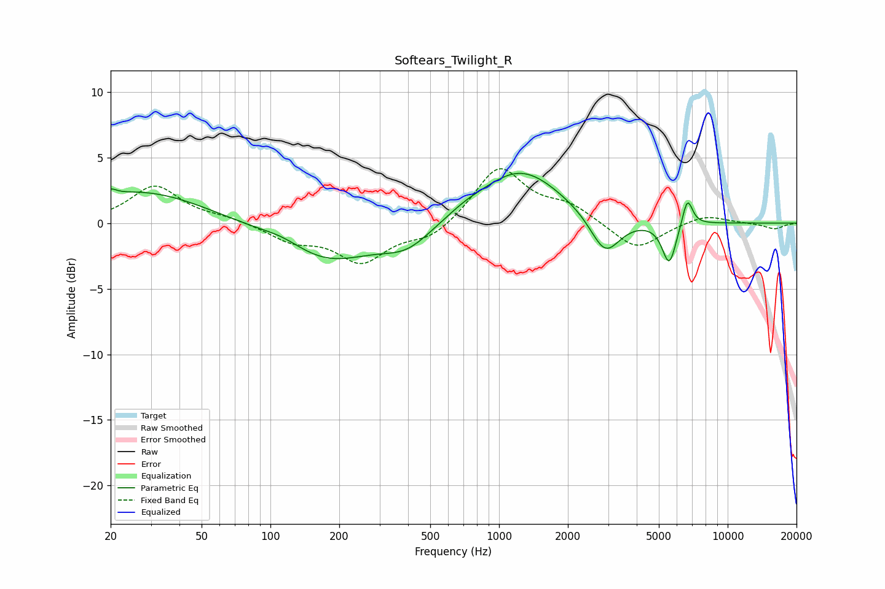

# Softears_Twilight_R
See [usage instructions](https://github.com/jaakkopasanen/AutoEq#usage) for more options and info.

### Parametric EQs
Apply preamp of -3.9 dB when using parametric equalizer.

|   # | Type    |   Fc (Hz) |    Q |   Gain (dB) |
|-----|---------|-----------|------|-------------|
|   1 | Peaking |        20 | 5.78 |         0.4 |
|   2 | Peaking |        27 | 0.5  |         2.5 |
|   3 | Peaking |       114 | 1.43 |         0.7 |
|   4 | Peaking |       173 | 0.66 |        -3   |
|   5 | Peaking |       397 | 1.29 |        -1.6 |
|   6 | Peaking |       711 | 1.83 |         0.3 |
|   7 | Peaking |      1239 | 0.78 |         4.1 |
|   8 | Peaking |      2911 | 2.15 |        -3   |
|   9 | Peaking |      5551 | 4.51 |        -3.2 |
|  10 | Peaking |      6664 | 6    |         2.2 |

### Fixed Band EQs
When using fixed band (also called graphic) equalizer, apply preamp of **-4.2 dB** (if available) and set gains manually with these parameters.

|   # | Type    |   Fc (Hz) |    Q |   Gain (dB) |
|-----|---------|-----------|------|-------------|
|   1 | Peaking |        31 | 1.41 |         2.8 |
|   2 | Peaking |        62 | 1.41 |         0.4 |
|   3 | Peaking |       125 | 1.41 |        -1.2 |
|   4 | Peaking |       250 | 1.41 |        -2.8 |
|   5 | Peaking |       500 | 1.41 |        -1.2 |
|   6 | Peaking |      1000 | 1.41 |         4.3 |
|   7 | Peaking |      2000 | 1.41 |         1.2 |
|   8 | Peaking |      4000 | 1.41 |        -2.1 |
|   9 | Peaking |      8000 | 1.41 |         0.7 |
|  10 | Peaking |     16000 | 1.41 |        -0.4 |

### Graphs

