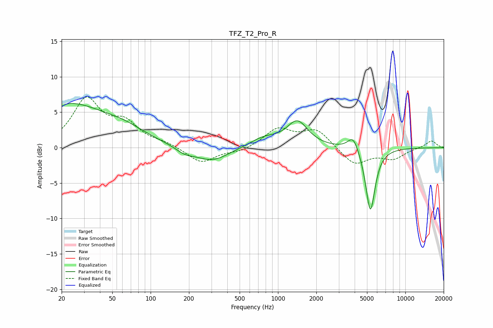

# TFZ_T2_Pro_R
See [usage instructions](https://github.com/jaakkopasanen/AutoEq#usage) for more options and info.

### Parametric EQs
Apply preamp of -6.3 dB when using parametric equalizer.

|   # | Type    |   Fc (Hz) |    Q |   Gain (dB) |
|-----|---------|-----------|------|-------------|
|   1 | Peaking |        20 | 5.91 |        -3.7 |
|   2 | Peaking |        20 | 5.93 |         3.2 |
|   3 | Peaking |        21 | 0.41 |         6.2 |
|   4 | Peaking |        64 | 0.89 |         1.1 |
|   5 | Peaking |       186 | 2    |        -0.8 |
|   6 | Peaking |       304 | 1.08 |        -2   |
|   7 | Peaking |       777 | 1.24 |         1.3 |
|   8 | Peaking |      1420 | 1.73 |         3.5 |
|   9 | Peaking |      3904 | 3.29 |         2.2 |
|  10 | Peaking |      5312 | 3.7  |        -9.2 |

### Fixed Band EQs
When using fixed band (also called graphic) equalizer, apply preamp of **-7.3 dB** (if available) and set gains manually with these parameters.

|   # | Type    |   Fc (Hz) |    Q |   Gain (dB) |
|-----|---------|-----------|------|-------------|
|   1 | Peaking |        31 | 1.41 |         6.6 |
|   2 | Peaking |        62 | 1.41 |         3   |
|   3 | Peaking |       125 | 1.41 |         0.6 |
|   4 | Peaking |       250 | 1.41 |        -2.2 |
|   5 | Peaking |       500 | 1.41 |        -0.6 |
|   6 | Peaking |      1000 | 1.41 |         2.6 |
|   7 | Peaking |      2000 | 1.41 |         2.5 |
|   8 | Peaking |      4000 | 1.41 |        -2.5 |
|   9 | Peaking |      8000 | 1.41 |        -1.5 |
|  10 | Peaking |     16000 | 1.41 |         1   |

### Graphs

