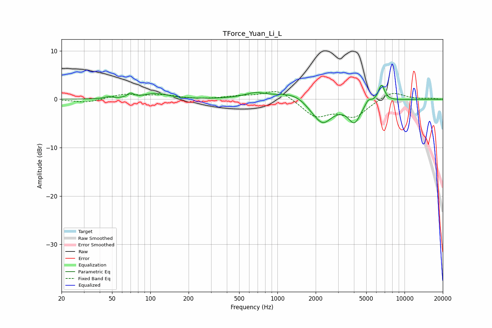

# TForce_Yuan_Li_L
See [usage instructions](https://github.com/jaakkopasanen/AutoEq#usage) for more options and info.

### Parametric EQs
Apply preamp of -3.0 dB when using parametric equalizer.

|   # | Type    |   Fc (Hz) |    Q |   Gain (dB) |
|-----|---------|-----------|------|-------------|
|   1 | Peaking |        47 | 4.87 |         0.4 |
|   2 | Peaking |        70 | 6    |         0.9 |
|   3 | Peaking |       111 | 1.55 |         1.2 |
|   4 | Peaking |       668 | 1.66 |         1.1 |
|   5 | Peaking |      1482 | 0.99 |         2.9 |
|   6 | Peaking |      2098 | 1.15 |        -4.7 |
|   7 | Peaking |      2298 | 2.65 |        -1.7 |
|   8 | Peaking |      4039 | 2.92 |        -4.1 |
|   9 | Peaking |      5180 | 6    |         1.1 |
|  10 | Peaking |      6586 | 5.52 |         3.4 |

### Fixed Band EQs
When using fixed band (also called graphic) equalizer, apply preamp of **-1.7 dB** (if available) and set gains manually with these parameters.

|   # | Type    |   Fc (Hz) |    Q |   Gain (dB) |
|-----|---------|-----------|------|-------------|
|   1 | Peaking |        31 | 1.41 |        -0.7 |
|   2 | Peaking |        62 | 1.41 |         1   |
|   3 | Peaking |       125 | 1.41 |         0.8 |
|   4 | Peaking |       250 | 1.41 |        -0.1 |
|   5 | Peaking |       500 | 1.41 |         0.5 |
|   6 | Peaking |      1000 | 1.41 |         2.2 |
|   7 | Peaking |      2000 | 1.41 |        -3.4 |
|   8 | Peaking |      4000 | 1.41 |        -3.4 |
|   9 | Peaking |      8000 | 1.41 |         1.7 |
|  10 | Peaking |     16000 | 1.41 |         0.2 |

### Graphs

