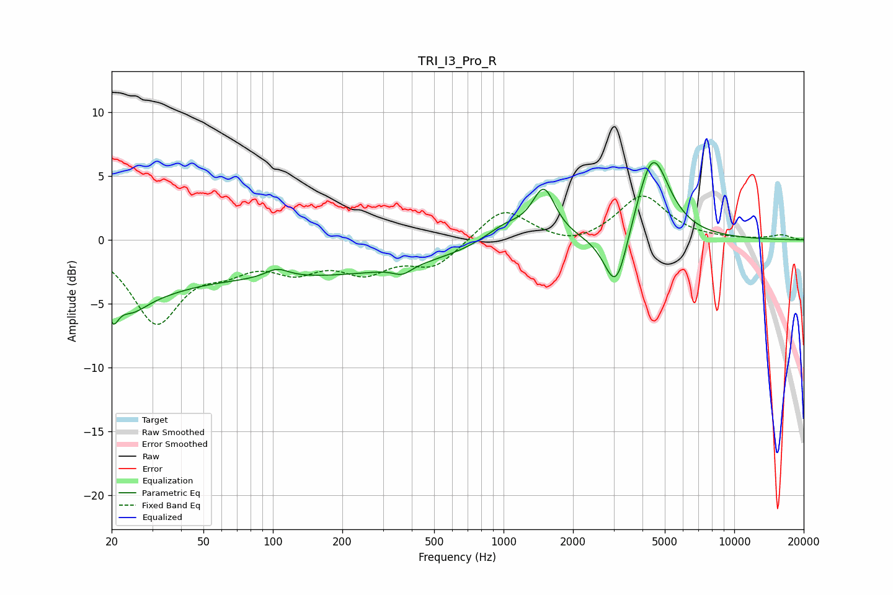

# TRI_I3_Pro_R
See [usage instructions](https://github.com/jaakkopasanen/AutoEq#usage) for more options and info.

### Parametric EQs
Apply preamp of -6.2 dB when using parametric equalizer.

|   # | Type    |   Fc (Hz) |    Q |   Gain (dB) |
|-----|---------|-----------|------|-------------|
|   1 | Peaking |        20 | 5.76 |        -2.4 |
|   2 | Peaking |        24 | 2.14 |        -1.6 |
|   3 | Peaking |        26 | 0.77 |        -2.2 |
|   4 | Peaking |       104 | 2.77 |         0.8 |
|   5 | Peaking |       119 | 0.2  |        -2.8 |
|   6 | Peaking |       365 | 3.55 |        -0.6 |
|   7 | Peaking |      1023 | 1.51 |         1.4 |
|   8 | Peaking |      1495 | 2.83 |         3.8 |
|   9 | Peaking |      3076 | 2.68 |        -5.2 |
|  10 | Peaking |      4419 | 1.95 |         7   |

### Fixed Band EQs
When using fixed band (also called graphic) equalizer, apply preamp of **-3.5 dB** (if available) and set gains manually with these parameters.

|   # | Type    |   Fc (Hz) |    Q |   Gain (dB) |
|-----|---------|-----------|------|-------------|
|   1 | Peaking |        31 | 1.41 |        -6.2 |
|   2 | Peaking |        62 | 1.41 |        -1.6 |
|   3 | Peaking |       125 | 1.41 |        -2   |
|   4 | Peaking |       250 | 1.41 |        -2.2 |
|   5 | Peaking |       500 | 1.41 |        -2   |
|   6 | Peaking |      1000 | 1.41 |         2.6 |
|   7 | Peaking |      2000 | 1.41 |        -0.7 |
|   8 | Peaking |      4000 | 1.41 |         3.5 |
|   9 | Peaking |      8000 | 1.41 |         0   |
|  10 | Peaking |     16000 | 1.41 |         0.4 |

### Graphs

