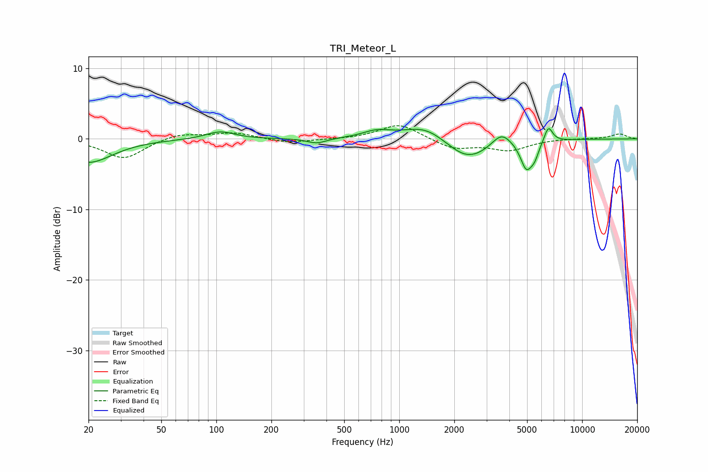

# TRI_Meteor_L
See [usage instructions](https://github.com/jaakkopasanen/AutoEq#usage) for more options and info.

### Parametric EQs
Apply preamp of -1.5 dB when using parametric equalizer.

|   # | Type    |   Fc (Hz) |    Q |   Gain (dB) |
|-----|---------|-----------|------|-------------|
|   1 | Peaking |        20 | 1.08 |        -3.3 |
|   2 | Peaking |       105 | 1.84 |         1.1 |
|   3 | Peaking |       354 | 2.64 |        -0.7 |
|   4 | Peaking |       753 | 1.86 |         1   |
|   5 | Peaking |      1399 | 1.16 |         2.2 |
|   6 | Peaking |      2360 | 1.17 |        -3.3 |
|   7 | Peaking |      3623 | 2.66 |         2   |
|   8 | Peaking |      4958 | 4.23 |        -3.9 |
|   9 | Peaking |      5498 | 5.97 |        -1.5 |
|  10 | Peaking |      6538 | 5.94 |         2.3 |

### Fixed Band EQs
When using fixed band (also called graphic) equalizer, apply preamp of **-2.0 dB** (if available) and set gains manually with these parameters.

|   # | Type    |   Fc (Hz) |    Q |   Gain (dB) |
|-----|---------|-----------|------|-------------|
|   1 | Peaking |        31 | 1.41 |        -2.8 |
|   2 | Peaking |        62 | 1.41 |         0.8 |
|   3 | Peaking |       125 | 1.41 |         0.9 |
|   4 | Peaking |       250 | 1.41 |        -0.6 |
|   5 | Peaking |       500 | 1.41 |        -0.1 |
|   6 | Peaking |      1000 | 1.41 |         2.2 |
|   7 | Peaking |      2000 | 1.41 |        -1.4 |
|   8 | Peaking |      4000 | 1.41 |        -1.5 |
|   9 | Peaking |      8000 | 1.41 |         0.1 |
|  10 | Peaking |     16000 | 1.41 |         0.7 |

### Graphs

