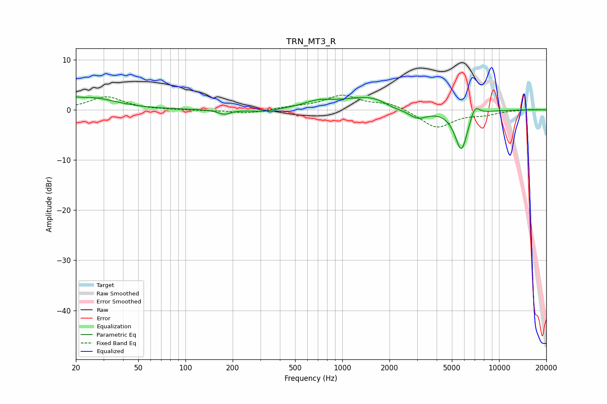

# TRN_MT3_R
See [usage instructions](https://github.com/jaakkopasanen/AutoEq#usage) for more options and info.

### Parametric EQs
Apply preamp of -2.7 dB when using parametric equalizer.

|   # | Type    |   Fc (Hz) |    Q |   Gain (dB) |
|-----|---------|-----------|------|-------------|
|   1 | Peaking |        20 | 5.9  |         0.5 |
|   2 | Peaking |        25 | 0.91 |         2.4 |
|   3 | Peaking |       177 | 3.48 |        -0.9 |
|   4 | Peaking |       315 | 1.74 |        -0.6 |
|   5 | Peaking |       702 | 1.55 |         1.2 |
|   6 | Peaking |      1530 | 0.82 |         2.7 |
|   7 | Peaking |      2124 | 2.11 |        -1   |
|   8 | Peaking |      3013 | 2.21 |        -2.1 |
|   9 | Peaking |      5747 | 3.33 |        -8.3 |
|  10 | Peaking |      7006 | 4.47 |         2.5 |

### Fixed Band EQs
When using fixed band (also called graphic) equalizer, apply preamp of **-3.0 dB** (if available) and set gains manually with these parameters.

|   # | Type    |   Fc (Hz) |    Q |   Gain (dB) |
|-----|---------|-----------|------|-------------|
|   1 | Peaking |        31 | 1.41 |         2.6 |
|   2 | Peaking |        62 | 1.41 |        -0   |
|   3 | Peaking |       125 | 1.41 |        -0.1 |
|   4 | Peaking |       250 | 1.41 |        -0.7 |
|   5 | Peaking |       500 | 1.41 |         0.5 |
|   6 | Peaking |      1000 | 1.41 |         2.7 |
|   7 | Peaking |      2000 | 1.41 |         1.3 |
|   8 | Peaking |      4000 | 1.41 |        -3.6 |
|   9 | Peaking |      8000 | 1.41 |        -0.8 |
|  10 | Peaking |     16000 | 1.41 |         0.1 |

### Graphs

