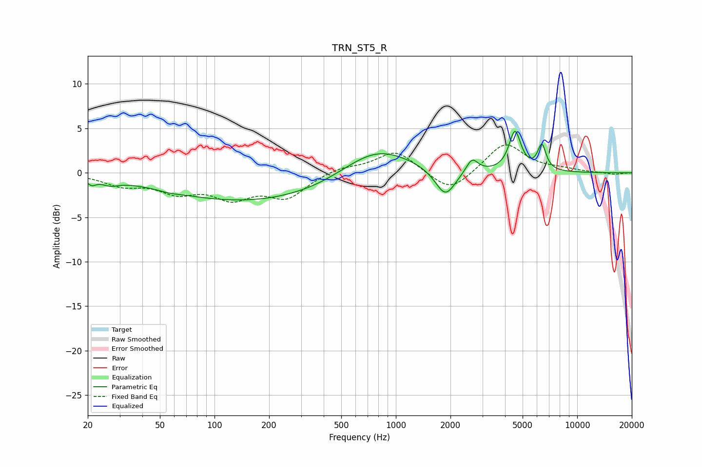

# TRN_ST5_R
See [usage instructions](https://github.com/jaakkopasanen/AutoEq#usage) for more options and info.

### Parametric EQs
Apply preamp of -4.8 dB when using parametric equalizer.

|   # | Type    |   Fc (Hz) |    Q |   Gain (dB) |
|-----|---------|-----------|------|-------------|
|   1 | Peaking |        21 | 5.9  |        -0.7 |
|   2 | Peaking |        27 | 3.05 |        -0.6 |
|   3 | Peaking |        57 | 2.92 |        -0.2 |
|   4 | Peaking |       161 | 0.29 |        -3.3 |
|   5 | Peaking |       374 | 2.98 |        -0   |
|   6 | Peaking |       779 | 0.74 |         3.4 |
|   7 | Peaking |      1875 | 2.53 |        -3.2 |
|   8 | Peaking |      2632 | 4.39 |         1.6 |
|   9 | Peaking |      4538 | 4.33 |         4.5 |
|  10 | Peaking |      6384 | 5.92 |         2.8 |

### Fixed Band EQs
When using fixed band (also called graphic) equalizer, apply preamp of **-3.2 dB** (if available) and set gains manually with these parameters.

|   # | Type    |   Fc (Hz) |    Q |   Gain (dB) |
|-----|---------|-----------|------|-------------|
|   1 | Peaking |        31 | 1.41 |        -1.3 |
|   2 | Peaking |        62 | 1.41 |        -1.9 |
|   3 | Peaking |       125 | 1.41 |        -2.5 |
|   4 | Peaking |       250 | 1.41 |        -2.6 |
|   5 | Peaking |       500 | 1.41 |         0.6 |
|   6 | Peaking |      1000 | 1.41 |         2.5 |
|   7 | Peaking |      2000 | 1.41 |        -2.4 |
|   8 | Peaking |      4000 | 1.41 |         3.4 |
|   9 | Peaking |      8000 | 1.41 |         0.3 |
|  10 | Peaking |     16000 | 1.41 |        -0.2 |

### Graphs

