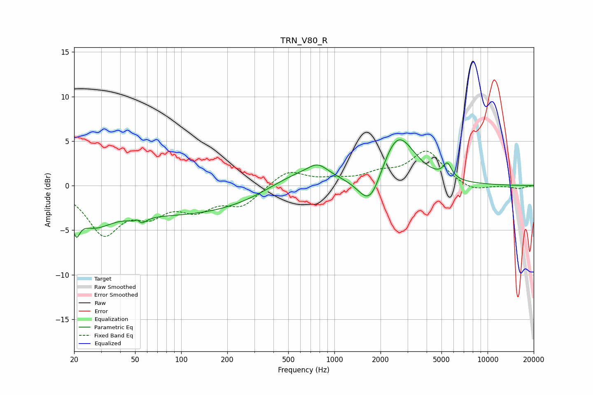

# TRN_V80_R
See [usage instructions](https://github.com/jaakkopasanen/AutoEq#usage) for more options and info.

### Parametric EQs
Apply preamp of -5.2 dB when using parametric equalizer.

|   # | Type    |   Fc (Hz) |    Q |   Gain (dB) |
|-----|---------|-----------|------|-------------|
|   1 | Peaking |        21 | 5.99 |        -2.3 |
|   2 | Peaking |        26 | 1.19 |        -2.6 |
|   3 | Peaking |        52 | 6    |         3.1 |
|   4 | Peaking |        53 | 5.04 |        -3.5 |
|   5 | Peaking |       102 | 0.23 |        -3.3 |
|   6 | Peaking |       567 | 0.67 |         2.2 |
|   7 | Peaking |       781 | 2.15 |         1.3 |
|   8 | Peaking |      1713 | 1.83 |        -4.2 |
|   9 | Peaking |      2578 | 1.28 |         6.1 |
|  10 | Peaking |      5469 | 5.11 |         1.6 |

### Fixed Band EQs
When using fixed band (also called graphic) equalizer, apply preamp of **-4.0 dB** (if available) and set gains manually with these parameters.

|   # | Type    |   Fc (Hz) |    Q |   Gain (dB) |
|-----|---------|-----------|------|-------------|
|   1 | Peaking |        31 | 1.41 |        -5.1 |
|   2 | Peaking |        62 | 1.41 |        -2.5 |
|   3 | Peaking |       125 | 1.41 |        -2.3 |
|   4 | Peaking |       250 | 1.41 |        -2.1 |
|   5 | Peaking |       500 | 1.41 |         1.8 |
|   6 | Peaking |      1000 | 1.41 |         0.5 |
|   7 | Peaking |      2000 | 1.41 |         1.1 |
|   8 | Peaking |      4000 | 1.41 |         3.8 |
|   9 | Peaking |      8000 | 1.41 |        -0.7 |
|  10 | Peaking |     16000 | 1.41 |        -0.3 |

### Graphs

