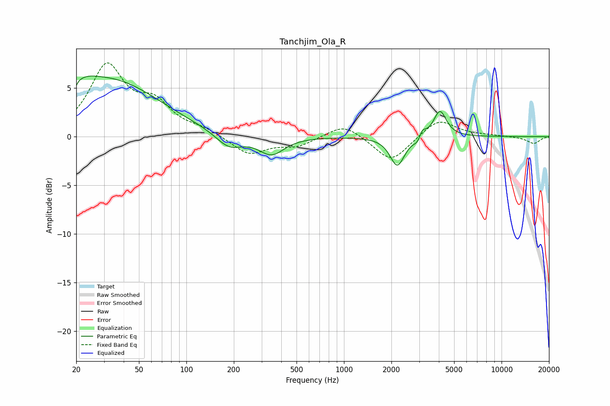

# Tanchjim_Ola_R
See [usage instructions](https://github.com/jaakkopasanen/AutoEq#usage) for more options and info.

### Parametric EQs
Apply preamp of -6.3 dB when using parametric equalizer.

|   # | Type    |   Fc (Hz) |    Q |   Gain (dB) |
|-----|---------|-----------|------|-------------|
|   1 | Peaking |        20 | 1.36 |         2   |
|   2 | Peaking |        20 | 5.53 |        -4.1 |
|   3 | Peaking |        20 | 5.98 |         3.2 |
|   4 | Peaking |        35 | 0.46 |         5.4 |
|   5 | Peaking |       186 | 1.67 |        -1.6 |
|   6 | Peaking |       346 | 1.75 |        -1.9 |
|   7 | Peaking |      2179 | 3.14 |        -3   |
|   8 | Peaking |      3023 | 5.3  |        -1.8 |
|   9 | Peaking |      3097 | 5.91 |         2.1 |
|  10 | Peaking |      4063 | 3.51 |         2.7 |

### Fixed Band EQs
When using fixed band (also called graphic) equalizer, apply preamp of **-7.7 dB** (if available) and set gains manually with these parameters.

|   # | Type    |   Fc (Hz) |    Q |   Gain (dB) |
|-----|---------|-----------|------|-------------|
|   1 | Peaking |        31 | 1.41 |         7   |
|   2 | Peaking |        62 | 1.41 |         2.9 |
|   3 | Peaking |       125 | 1.41 |         0.6 |
|   4 | Peaking |       250 | 1.41 |        -1.9 |
|   5 | Peaking |       500 | 1.41 |        -0.9 |
|   6 | Peaking |      1000 | 1.41 |         1.4 |
|   7 | Peaking |      2000 | 1.41 |        -2.7 |
|   8 | Peaking |      4000 | 1.41 |         1.9 |
|   9 | Peaking |      8000 | 1.41 |         0.1 |
|  10 | Peaking |     16000 | 1.41 |        -0.7 |

### Graphs

