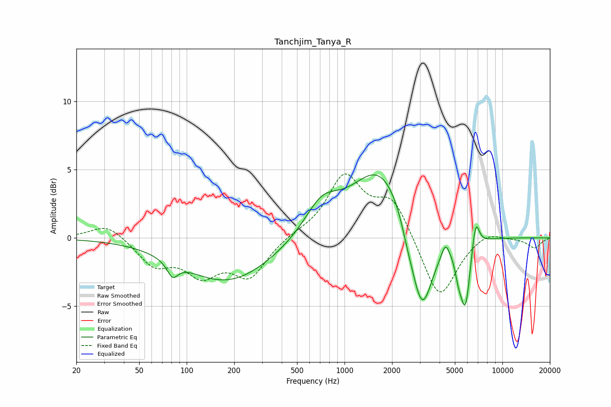

# Tanchjim_Tanya_R
See [usage instructions](https://github.com/jaakkopasanen/AutoEq#usage) for more options and info.

### Parametric EQs
Apply preamp of -4.7 dB when using parametric equalizer.

|   # | Type    |   Fc (Hz) |    Q |   Gain (dB) |
|-----|---------|-----------|------|-------------|
|   1 | Peaking |        81 | 4.09 |        -1.1 |
|   2 | Peaking |       181 | 0.5  |        -3.2 |
|   3 | Peaking |       717 | 1.29 |         2.3 |
|   4 | Peaking |      1714 | 0.77 |         5.4 |
|   5 | Peaking |      2504 | 3.89 |        -0.7 |
|   6 | Peaking |      3085 | 1.94 |        -7   |
|   7 | Peaking |      4358 | 5.91 |         1   |
|   8 | Peaking |      5270 | 6    |        -1.4 |
|   9 | Peaking |      5829 | 4.46 |        -4.8 |
|  10 | Peaking |      6771 | 5.99 |         2.2 |

### Fixed Band EQs
When using fixed band (also called graphic) equalizer, apply preamp of **-4.8 dB** (if available) and set gains manually with these parameters.

|   # | Type    |   Fc (Hz) |    Q |   Gain (dB) |
|-----|---------|-----------|------|-------------|
|   1 | Peaking |        31 | 1.41 |         1.1 |
|   2 | Peaking |        62 | 1.41 |        -1.9 |
|   3 | Peaking |       125 | 1.41 |        -2.4 |
|   4 | Peaking |       250 | 1.41 |        -2.7 |
|   5 | Peaking |       500 | 1.41 |         0.3 |
|   6 | Peaking |      1000 | 1.41 |         4.4 |
|   7 | Peaking |      2000 | 1.41 |         2.8 |
|   8 | Peaking |      4000 | 1.41 |        -4.6 |
|   9 | Peaking |      8000 | 1.41 |         0.6 |
|  10 | Peaking |     16000 | 1.41 |        -0.7 |

### Graphs

