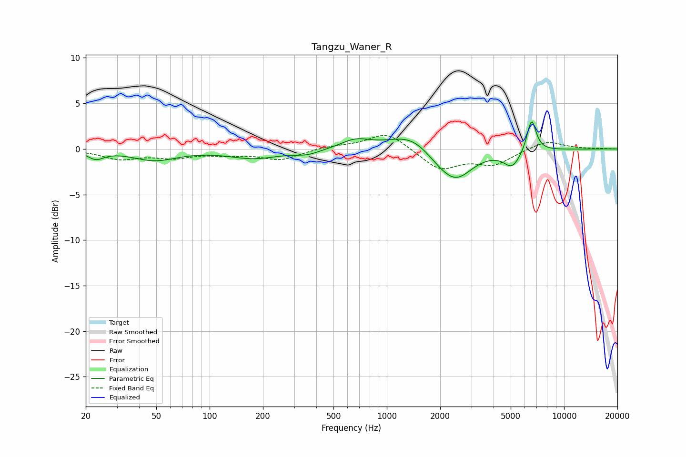

# Tangzu_Waner_R
See [usage instructions](https://github.com/jaakkopasanen/AutoEq#usage) for more options and info.

### Parametric EQs
Apply preamp of -3.1 dB when using parametric equalizer.

|   # | Type    |   Fc (Hz) |    Q |   Gain (dB) |
|-----|---------|-----------|------|-------------|
|   1 | Peaking |        23 | 3.16 |        -0.9 |
|   2 | Peaking |        49 | 1.13 |        -1.2 |
|   3 | Peaking |       179 | 0.99 |        -1   |
|   4 | Peaking |       357 | 1.92 |        -0.5 |
|   5 | Peaking |       666 | 1.72 |         1   |
|   6 | Peaking |      1391 | 1.1  |         1.9 |
|   7 | Peaking |      1949 | 1.54 |        -1   |
|   8 | Peaking |      2463 | 1.51 |        -3.1 |
|   9 | Peaking |      5099 | 2.95 |        -1.8 |
|  10 | Peaking |      6556 | 5.27 |         3.6 |

### Fixed Band EQs
When using fixed band (also called graphic) equalizer, apply preamp of **-1.6 dB** (if available) and set gains manually with these parameters.

|   # | Type    |   Fc (Hz) |    Q |   Gain (dB) |
|-----|---------|-----------|------|-------------|
|   1 | Peaking |        31 | 1.41 |        -1   |
|   2 | Peaking |        62 | 1.41 |        -0.8 |
|   3 | Peaking |       125 | 1.41 |        -0.5 |
|   4 | Peaking |       250 | 1.41 |        -1.1 |
|   5 | Peaking |       500 | 1.41 |         0.3 |
|   6 | Peaking |      1000 | 1.41 |         1.9 |
|   7 | Peaking |      2000 | 1.41 |        -2.2 |
|   8 | Peaking |      4000 | 1.41 |        -1.6 |
|   9 | Peaking |      8000 | 1.41 |         1   |
|  10 | Peaking |     16000 | 1.41 |         0   |

### Graphs

