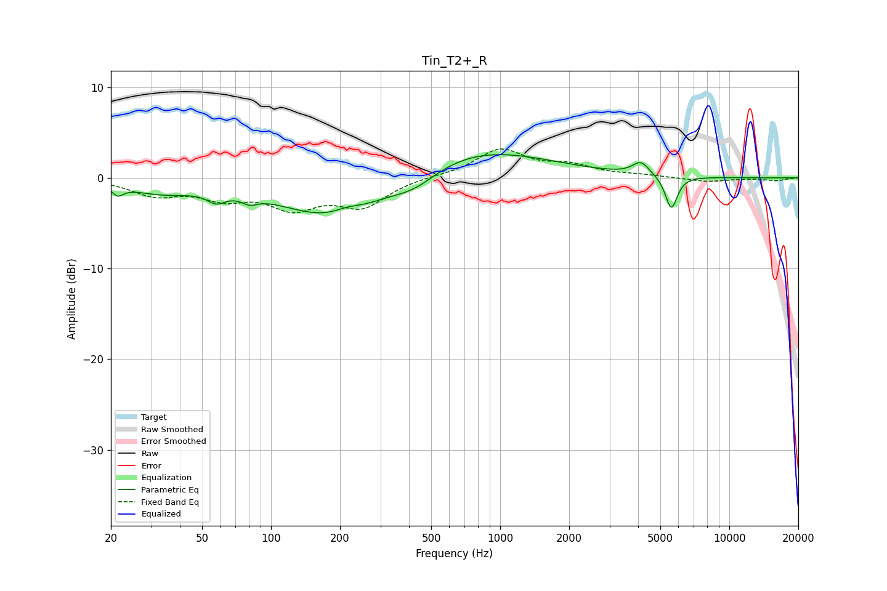

# Tin_T2+_R
See [usage instructions](https://github.com/jaakkopasanen/AutoEq#usage) for more options and info.

### Parametric EQs
Apply preamp of -2.7 dB when using parametric equalizer.

|   # | Type    |   Fc (Hz) |    Q |   Gain (dB) |
|-----|---------|-----------|------|-------------|
|   1 | Peaking |        21 | 5.82 |        -1   |
|   2 | Peaking |        33 | 0.94 |        -1.4 |
|   3 | Peaking |        58 | 3.57 |        -1.1 |
|   4 | Peaking |        81 | 4.02 |        -0.8 |
|   5 | Peaking |       190 | 0.61 |        -4.7 |
|   6 | Peaking |       214 | 2.39 |         0.6 |
|   7 | Peaking |       424 | 1.35 |        -1.7 |
|   8 | Peaking |       754 | 0.44 |         3.4 |
|   9 | Peaking |      4114 | 3.84 |         1.5 |
|  10 | Peaking |      5583 | 5.37 |        -3.7 |

### Fixed Band EQs
When using fixed band (also called graphic) equalizer, apply preamp of **-3.3 dB** (if available) and set gains manually with these parameters.

|   # | Type    |   Fc (Hz) |    Q |   Gain (dB) |
|-----|---------|-----------|------|-------------|
|   1 | Peaking |        31 | 1.41 |        -1.7 |
|   2 | Peaking |        62 | 1.41 |        -1.9 |
|   3 | Peaking |       125 | 1.41 |        -2.9 |
|   4 | Peaking |       250 | 1.41 |        -3   |
|   5 | Peaking |       500 | 1.41 |         0.2 |
|   6 | Peaking |      1000 | 1.41 |         3.1 |
|   7 | Peaking |      2000 | 1.41 |         1.2 |
|   8 | Peaking |      4000 | 1.41 |         0.2 |
|   9 | Peaking |      8000 | 1.41 |        -0.4 |
|  10 | Peaking |     16000 | 1.41 |        -0.3 |

### Graphs

