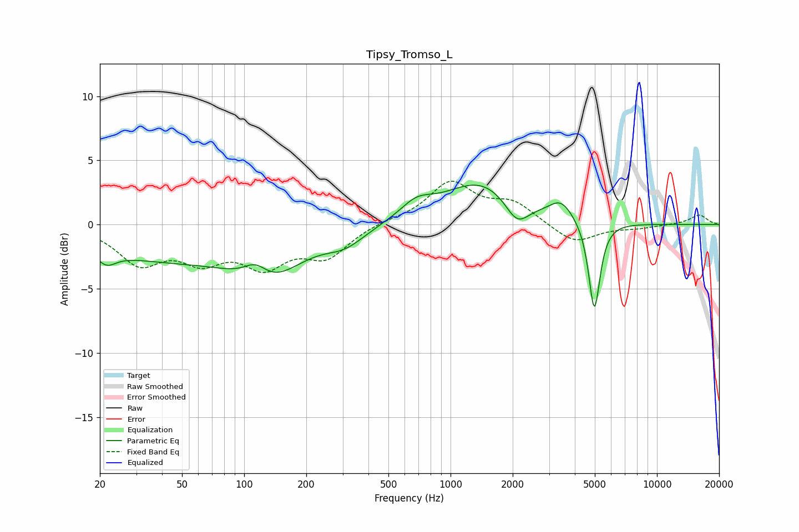

# Tipsy_Tromso_L
See [usage instructions](https://github.com/jaakkopasanen/AutoEq#usage) for more options and info.

### Parametric EQs
Apply preamp of -3.2 dB when using parametric equalizer.

|   # | Type    |   Fc (Hz) |    Q |   Gain (dB) |
|-----|---------|-----------|------|-------------|
|   1 | Peaking |        22 | 3.11 |        -1   |
|   2 | Peaking |        42 | 0.35 |        -2.5 |
|   3 | Peaking |       114 | 2.37 |         1.4 |
|   4 | Peaking |       131 | 0.9  |        -3.2 |
|   5 | Peaking |       308 | 1.46 |        -1.2 |
|   6 | Peaking |       682 | 1.8  |         1.2 |
|   7 | Peaking |      1402 | 0.78 |         3.3 |
|   8 | Peaking |      2100 | 2.43 |        -2   |
|   9 | Peaking |      3437 | 2.43 |         1.4 |
|  10 | Peaking |      4973 | 5.11 |        -7.1 |

### Fixed Band EQs
When using fixed band (also called graphic) equalizer, apply preamp of **-3.5 dB** (if available) and set gains manually with these parameters.

|   # | Type    |   Fc (Hz) |    Q |   Gain (dB) |
|-----|---------|-----------|------|-------------|
|   1 | Peaking |        31 | 1.41 |        -2.8 |
|   2 | Peaking |        62 | 1.41 |        -2.3 |
|   3 | Peaking |       125 | 1.41 |        -2.8 |
|   4 | Peaking |       250 | 1.41 |        -2.3 |
|   5 | Peaking |       500 | 1.41 |         0.3 |
|   6 | Peaking |      1000 | 1.41 |         3.2 |
|   7 | Peaking |      2000 | 1.41 |         1.6 |
|   8 | Peaking |      4000 | 1.41 |        -1.5 |
|   9 | Peaking |      8000 | 1.41 |        -0.2 |
|  10 | Peaking |     16000 | 1.41 |         0.8 |

### Graphs

