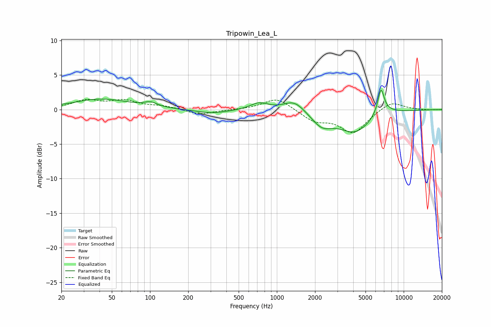

# Tripowin_Lea_L
See [usage instructions](https://github.com/jaakkopasanen/AutoEq#usage) for more options and info.

### Parametric EQs
Apply preamp of -2.9 dB when using parametric equalizer.

|   # | Type    |   Fc (Hz) |    Q |   Gain (dB) |
|-----|---------|-----------|------|-------------|
|   1 | Peaking |        24 | 4.42 |        -0   |
|   2 | Peaking |        41 | 0.63 |         1.5 |
|   3 | Peaking |       101 | 2.87 |         0.6 |
|   4 | Peaking |       309 | 1.1  |        -0.6 |
|   5 | Peaking |       725 | 2.04 |         1   |
|   6 | Peaking |      1373 | 1.72 |         1.6 |
|   7 | Peaking |      2260 | 1.7  |        -2   |
|   8 | Peaking |      4152 | 1.08 |        -3.2 |
|   9 | Peaking |      6613 | 5.68 |         3.4 |
|  10 | Peaking |      6825 | 1.9  |         0.9 |

### Fixed Band EQs
When using fixed band (also called graphic) equalizer, apply preamp of **-1.6 dB** (if available) and set gains manually with these parameters.

|   # | Type    |   Fc (Hz) |    Q |   Gain (dB) |
|-----|---------|-----------|------|-------------|
|   1 | Peaking |        31 | 1.41 |         1.2 |
|   2 | Peaking |        62 | 1.41 |         1.2 |
|   3 | Peaking |       125 | 1.41 |         0.4 |
|   4 | Peaking |       250 | 1.41 |        -0.7 |
|   5 | Peaking |       500 | 1.41 |        -0   |
|   6 | Peaking |      1000 | 1.41 |         1.8 |
|   7 | Peaking |      2000 | 1.41 |        -1.6 |
|   8 | Peaking |      4000 | 1.41 |        -3.3 |
|   9 | Peaking |      8000 | 1.41 |         1.3 |
|  10 | Peaking |     16000 | 1.41 |        -0.1 |

### Graphs

