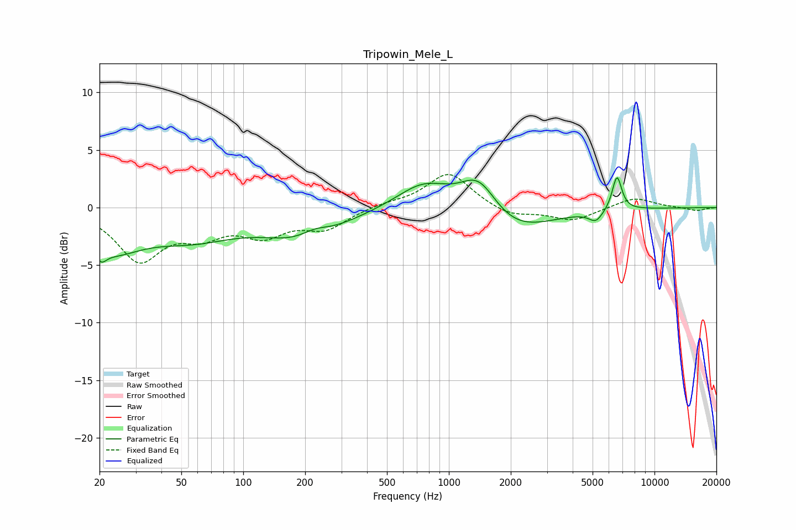

# Tripowin_Mele_L
See [usage instructions](https://github.com/jaakkopasanen/AutoEq#usage) for more options and info.

### Parametric EQs
Apply preamp of -2.7 dB when using parametric equalizer.

|   # | Type    |   Fc (Hz) |    Q |   Gain (dB) |
|-----|---------|-----------|------|-------------|
|   1 | Peaking |        20 | 5.56 |        -1   |
|   2 | Peaking |        23 | 0.95 |        -3.1 |
|   3 | Peaking |        57 | 0.64 |        -2.3 |
|   4 | Peaking |       200 | 0.74 |        -2.5 |
|   5 | Peaking |       222 | 2.01 |         0.8 |
|   6 | Peaking |       758 | 1.07 |         2.3 |
|   7 | Peaking |      1399 | 1.52 |         3.5 |
|   8 | Peaking |      1974 | 0.75 |        -2.5 |
|   9 | Peaking |      5190 | 4.09 |        -0.9 |
|  10 | Peaking |      6568 | 5.93 |         3   |

### Fixed Band EQs
When using fixed band (also called graphic) equalizer, apply preamp of **-3.0 dB** (if available) and set gains manually with these parameters.

|   # | Type    |   Fc (Hz) |    Q |   Gain (dB) |
|-----|---------|-----------|------|-------------|
|   1 | Peaking |        31 | 1.41 |        -4.4 |
|   2 | Peaking |        62 | 1.41 |        -1.9 |
|   3 | Peaking |       125 | 1.41 |        -2.1 |
|   4 | Peaking |       250 | 1.41 |        -1.7 |
|   5 | Peaking |       500 | 1.41 |         0.3 |
|   6 | Peaking |      1000 | 1.41 |         3.1 |
|   7 | Peaking |      2000 | 1.41 |        -0.8 |
|   8 | Peaking |      4000 | 1.41 |        -1.1 |
|   9 | Peaking |      8000 | 1.41 |         0.9 |
|  10 | Peaking |     16000 | 1.41 |        -0.3 |

### Graphs

