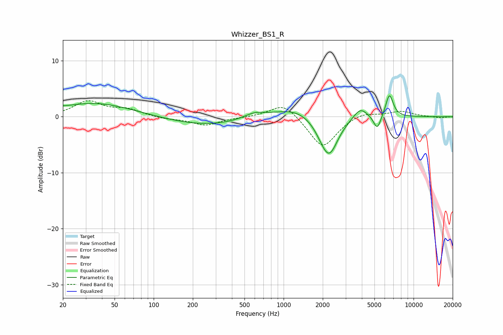

# Whizzer_BS1_R
See [usage instructions](https://github.com/jaakkopasanen/AutoEq#usage) for more options and info.

### Parametric EQs
Apply preamp of -3.8 dB when using parametric equalizer.

|   # | Type    |   Fc (Hz) |    Q |   Gain (dB) |
|-----|---------|-----------|------|-------------|
|   1 | Peaking |        20 | 6    |         0.1 |
|   2 | Peaking |        35 | 0.49 |         2.5 |
|   3 | Peaking |       250 | 0.48 |        -1.5 |
|   4 | Peaking |       596 | 1.74 |         1   |
|   5 | Peaking |      1238 | 0.85 |         1.8 |
|   6 | Peaking |      1987 | 2.1  |        -1.1 |
|   7 | Peaking |      2244 | 2.04 |        -6.6 |
|   8 | Peaking |      3889 | 2.63 |         2   |
|   9 | Peaking |      5255 | 4.95 |        -2.6 |
|  10 | Peaking |      6519 | 4.72 |         4.1 |

### Fixed Band EQs
When using fixed band (also called graphic) equalizer, apply preamp of **-3.0 dB** (if available) and set gains manually with these parameters.

|   # | Type    |   Fc (Hz) |    Q |   Gain (dB) |
|-----|---------|-----------|------|-------------|
|   1 | Peaking |        31 | 1.41 |         2.7 |
|   2 | Peaking |        62 | 1.41 |         1.2 |
|   3 | Peaking |       125 | 1.41 |        -0.4 |
|   4 | Peaking |       250 | 1.41 |        -1.5 |
|   5 | Peaking |       500 | 1.41 |        -0.1 |
|   6 | Peaking |      1000 | 1.41 |         2.7 |
|   7 | Peaking |      2000 | 1.41 |        -5.7 |
|   8 | Peaking |      4000 | 1.41 |         1   |
|   9 | Peaking |      8000 | 1.41 |         1   |
|  10 | Peaking |     16000 | 1.41 |        -0.2 |

### Graphs

