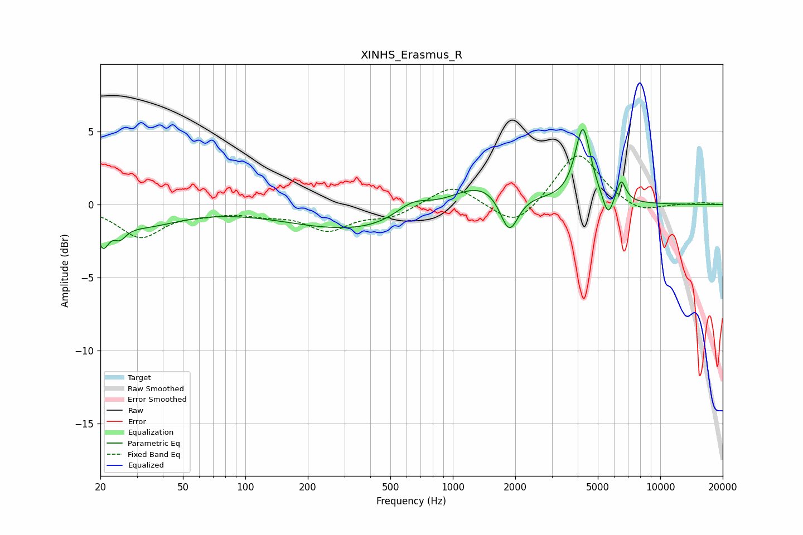

# XINHS_Erasmus_R
See [usage instructions](https://github.com/jaakkopasanen/AutoEq#usage) for more options and info.

### Parametric EQs
Apply preamp of -5.2 dB when using parametric equalizer.

|   # | Type    |   Fc (Hz) |    Q |   Gain (dB) |
|-----|---------|-----------|------|-------------|
|   1 | Peaking |        21 | 5.16 |        -1.8 |
|   2 | Peaking |        25 | 4.72 |        -0.8 |
|   3 | Peaking |        31 | 0.77 |        -1.3 |
|   4 | Peaking |       396 | 0.37 |        -1.9 |
|   5 | Peaking |       638 | 1.63 |         1.2 |
|   6 | Peaking |      1381 | 0.85 |         2.1 |
|   7 | Peaking |      1870 | 3.15 |        -2.9 |
|   8 | Peaking |      4237 | 3.78 |         5.1 |
|   9 | Peaking |      5603 | 5.43 |        -1.6 |
|  10 | Peaking |      6477 | 6    |         1.5 |

### Fixed Band EQs
When using fixed band (also called graphic) equalizer, apply preamp of **-3.4 dB** (if available) and set gains manually with these parameters.

|   # | Type    |   Fc (Hz) |    Q |   Gain (dB) |
|-----|---------|-----------|------|-------------|
|   1 | Peaking |        31 | 1.41 |        -2.2 |
|   2 | Peaking |        62 | 1.41 |        -0.4 |
|   3 | Peaking |       125 | 1.41 |        -0.5 |
|   4 | Peaking |       250 | 1.41 |        -1.6 |
|   5 | Peaking |       500 | 1.41 |        -0.8 |
|   6 | Peaking |      1000 | 1.41 |         1.4 |
|   7 | Peaking |      2000 | 1.41 |        -1.7 |
|   8 | Peaking |      4000 | 1.41 |         3.7 |
|   9 | Peaking |      8000 | 1.41 |        -0.7 |
|  10 | Peaking |     16000 | 1.41 |         0.1 |

### Graphs

