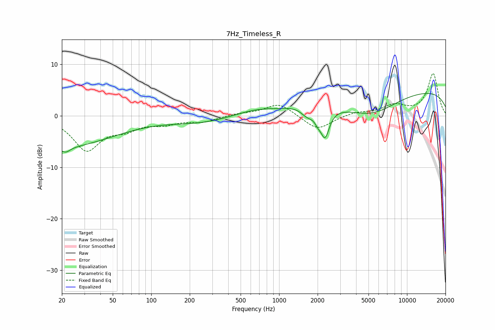

# 7Hz_Timeless_R
See [usage instructions](https://github.com/jaakkopasanen/AutoEq#usage) for more options and info.

### Parametric EQs
Apply preamp of -4.4 dB when using parametric equalizer.

|   # | Type    |   Fc (Hz) |    Q |   Gain (dB) |
|-----|---------|-----------|------|-------------|
|   1 | Peaking |        20 | 0.34 |        -5.9 |
|   2 | Peaking |        21 | 3.87 |        -1.1 |
|   3 | Peaking |       243 | 0.59 |        -1.3 |
|   4 | Peaking |       668 | 0.83 |         1.2 |
|   5 | Peaking |      1587 | 1.29 |         1.6 |
|   6 | Peaking |      1663 | 2.36 |        -2.5 |
|   7 | Peaking |      2007 | 5.95 |        -1.2 |
|   8 | Peaking |      2284 | 4.11 |        -5.4 |
|   9 | Peaking |      5299 | 0.68 |        -4.1 |
|  10 | Peaking |     10000 | 0.18 |         5.2 |

### Fixed Band EQs
When using fixed band (also called graphic) equalizer, apply preamp of **-8.3 dB** (if available) and set gains manually with these parameters.

|   # | Type    |   Fc (Hz) |    Q |   Gain (dB) |
|-----|---------|-----------|------|-------------|
|   1 | Peaking |        31 | 1.41 |        -6.5 |
|   2 | Peaking |        62 | 1.41 |        -2   |
|   3 | Peaking |       125 | 1.41 |        -1.3 |
|   4 | Peaking |       250 | 1.41 |        -1.1 |
|   5 | Peaking |       500 | 1.41 |         0.4 |
|   6 | Peaking |      1000 | 1.41 |         2.5 |
|   7 | Peaking |      2000 | 1.41 |        -2.9 |
|   8 | Peaking |      4000 | 1.41 |         0.7 |
|   9 | Peaking |      8000 | 1.41 |         1.9 |
|  10 | Peaking |     16000 | 1.41 |         8.2 |

### Graphs

