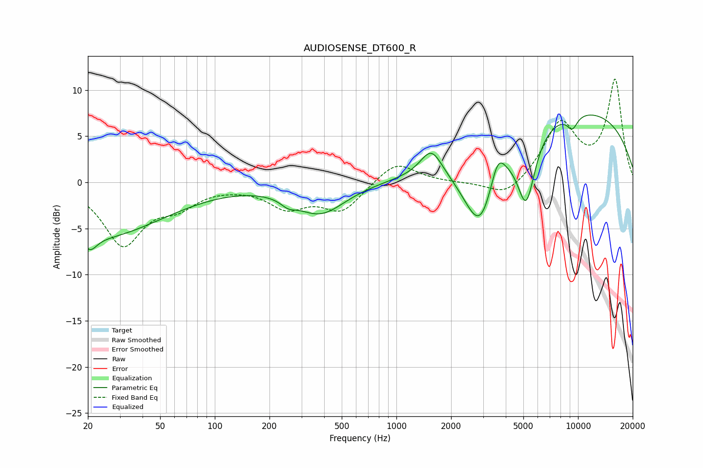

# AUDIOSENSE_DT600_R
See [usage instructions](https://github.com/jaakkopasanen/AutoEq#usage) for more options and info.

### Parametric EQs
Apply preamp of -7.4 dB when using parametric equalizer.

|   # | Type    |   Fc (Hz) |    Q |   Gain (dB) |
|-----|---------|-----------|------|-------------|
|   1 | Peaking |        21 | 4.04 |        -1.4 |
|   2 | Peaking |        22 | 0.38 |        -5.9 |
|   3 | Peaking |       254 | 3.5  |        -0.7 |
|   4 | Peaking |       381 | 1.02 |        -3.3 |
|   5 | Peaking |      1557 | 2.38 |         3   |
|   6 | Peaking |      2902 | 1.44 |        -9.1 |
|   7 | Peaking |      3609 | 3.33 |         3.4 |
|   8 | Peaking |      5184 | 2.82 |        -7.4 |
|   9 | Peaking |      9097 | 0.23 |         8.1 |
|  10 | Peaking |      9299 | 4.19 |        -1.5 |

### Fixed Band EQs
When using fixed band (also called graphic) equalizer, apply preamp of **-11.3 dB** (if available) and set gains manually with these parameters.

|   # | Type    |   Fc (Hz) |    Q |   Gain (dB) |
|-----|---------|-----------|------|-------------|
|   1 | Peaking |        31 | 1.41 |        -6.6 |
|   2 | Peaking |        62 | 1.41 |        -2.1 |
|   3 | Peaking |       125 | 1.41 |        -0.2 |
|   4 | Peaking |       250 | 1.41 |        -2.5 |
|   5 | Peaking |       500 | 1.41 |        -3   |
|   6 | Peaking |      1000 | 1.41 |         2.4 |
|   7 | Peaking |      2000 | 1.41 |        -0.1 |
|   8 | Peaking |      4000 | 1.41 |        -1.8 |
|   9 | Peaking |      8000 | 1.41 |         6.3 |
|  10 | Peaking |     16000 | 1.41 |        10.9 |

### Graphs

