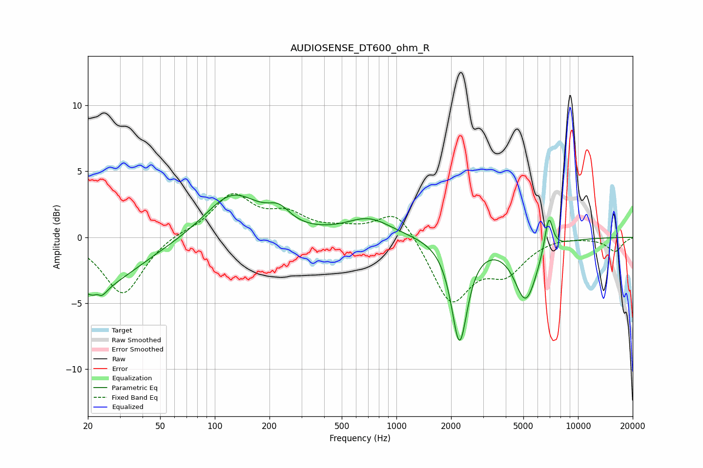

# AUDIOSENSE_DT600_ohm_R
See [usage instructions](https://github.com/jaakkopasanen/AutoEq#usage) for more options and info.

### Parametric EQs
Apply preamp of -3.3 dB when using parametric equalizer.

|   # | Type    |   Fc (Hz) |    Q |   Gain (dB) |
|-----|---------|-----------|------|-------------|
|   1 | Peaking |        20 | 0.55 |        -4.1 |
|   2 | Peaking |        23 | 6    |         3   |
|   3 | Peaking |        23 | 5.16 |        -3.5 |
|   4 | Peaking |       125 | 0.95 |         3.4 |
|   5 | Peaking |       225 | 2.3  |         1.1 |
|   6 | Peaking |       705 | 1.14 |         1.4 |
|   7 | Peaking |      2225 | 3.22 |        -7.7 |
|   8 | Peaking |      5147 | 2.26 |        -4.6 |
|   9 | Peaking |      5829 | 5.82 |        -0.1 |
|  10 | Peaking |      6901 | 6    |         2.8 |

### Fixed Band EQs
When using fixed band (also called graphic) equalizer, apply preamp of **-3.4 dB** (if available) and set gains manually with these parameters.

|   # | Type    |   Fc (Hz) |    Q |   Gain (dB) |
|-----|---------|-----------|------|-------------|
|   1 | Peaking |        31 | 1.41 |        -4.4 |
|   2 | Peaking |        62 | 1.41 |         0.4 |
|   3 | Peaking |       125 | 1.41 |         3.1 |
|   4 | Peaking |       250 | 1.41 |         1.5 |
|   5 | Peaking |       500 | 1.41 |         0.5 |
|   6 | Peaking |      1000 | 1.41 |         2.3 |
|   7 | Peaking |      2000 | 1.41 |        -4.9 |
|   8 | Peaking |      4000 | 1.41 |        -2.3 |
|   9 | Peaking |      8000 | 1.41 |         0.1 |
|  10 | Peaking |     16000 | 1.41 |        -1.1 |

### Graphs

