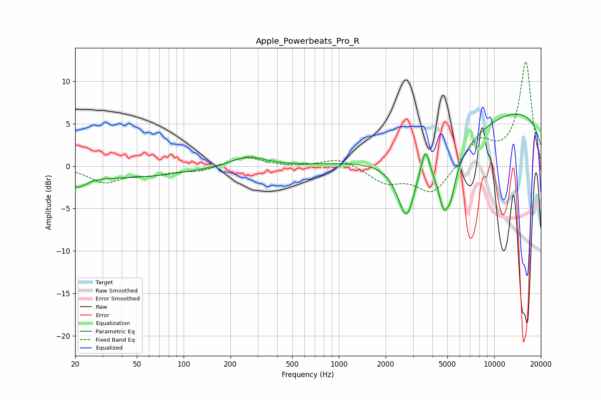

# Apple_Powerbeats_Pro_R
See [usage instructions](https://github.com/jaakkopasanen/AutoEq#usage) for more options and info.

### Parametric EQs
Apply preamp of -6.2 dB when using parametric equalizer.

|   # | Type    |   Fc (Hz) |    Q |   Gain (dB) |
|-----|---------|-----------|------|-------------|
|   1 | Peaking |        21 | 2.49 |        -1.5 |
|   2 | Peaking |        42 | 0.39 |        -1.3 |
|   3 | Peaking |       260 | 1.32 |         1.2 |
|   4 | Peaking |      2734 | 2.41 |        -7.8 |
|   5 | Peaking |      3055 | 1.47 |         3.1 |
|   6 | Peaking |      3607 | 4.77 |         3.8 |
|   7 | Peaking |      4039 | 0.67 |        -7.2 |
|   8 | Peaking |      4714 | 5.04 |        -3.4 |
|   9 | Peaking |      5240 | 4.47 |        -3.3 |
|  10 | Peaking |     10000 | 0.18 |         7.1 |

### Fixed Band EQs
When using fixed band (also called graphic) equalizer, apply preamp of **-12.4 dB** (if available) and set gains manually with these parameters.

|   # | Type    |   Fc (Hz) |    Q |   Gain (dB) |
|-----|---------|-----------|------|-------------|
|   1 | Peaking |        31 | 1.41 |        -1.8 |
|   2 | Peaking |        62 | 1.41 |        -0.8 |
|   3 | Peaking |       125 | 1.41 |        -0.6 |
|   4 | Peaking |       250 | 1.41 |         1.1 |
|   5 | Peaking |       500 | 1.41 |        -0.1 |
|   6 | Peaking |      1000 | 1.41 |         1   |
|   7 | Peaking |      2000 | 1.41 |        -1.8 |
|   8 | Peaking |      4000 | 1.41 |        -3.3 |
|   9 | Peaking |      8000 | 1.41 |         3   |
|  10 | Peaking |     16000 | 1.41 |        12.3 |

### Graphs

