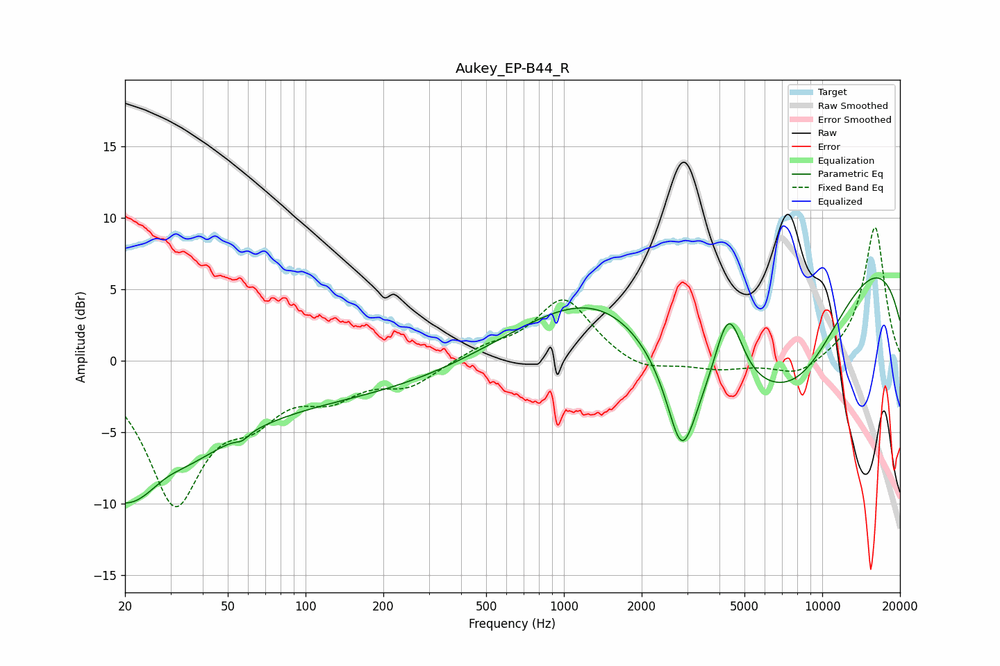

# Aukey_EP-B44_R
See [usage instructions](https://github.com/jaakkopasanen/AutoEq#usage) for more options and info.

### Parametric EQs
Apply preamp of -5.9 dB when using parametric equalizer.

|   # | Type    |   Fc (Hz) |    Q |   Gain (dB) |
|-----|---------|-----------|------|-------------|
|   1 | Peaking |        20 | 0.61 |        -8.5 |
|   2 | Peaking |        28 | 1.71 |         1.2 |
|   3 | Peaking |        57 | 5.92 |        -0.4 |
|   4 | Peaking |        72 | 0.18 |        -2.6 |
|   5 | Peaking |      1502 | 0.45 |         6.4 |
|   6 | Peaking |      2858 | 2.59 |        -5.8 |
|   7 | Peaking |      3437 | 0.47 |       -10.9 |
|   8 | Peaking |      4334 | 2.46 |         6.1 |
|   9 | Peaking |      8091 | 0.62 |        -6.6 |
|  10 | Peaking |      9277 | 0.18 |         9.8 |

### Fixed Band EQs
When using fixed band (also called graphic) equalizer, apply preamp of **-9.4 dB** (if available) and set gains manually with these parameters.

|   # | Type    |   Fc (Hz) |    Q |   Gain (dB) |
|-----|---------|-----------|------|-------------|
|   1 | Peaking |        31 | 1.41 |        -9.6 |
|   2 | Peaking |        62 | 1.41 |        -2.8 |
|   3 | Peaking |       125 | 1.41 |        -2   |
|   4 | Peaking |       250 | 1.41 |        -1.6 |
|   5 | Peaking |       500 | 1.41 |         0.8 |
|   6 | Peaking |      1000 | 1.41 |         4.4 |
|   7 | Peaking |      2000 | 1.41 |        -0.9 |
|   8 | Peaking |      4000 | 1.41 |        -0.6 |
|   9 | Peaking |      8000 | 1.41 |        -1.1 |
|  10 | Peaking |     16000 | 1.41 |         9.5 |

### Graphs

