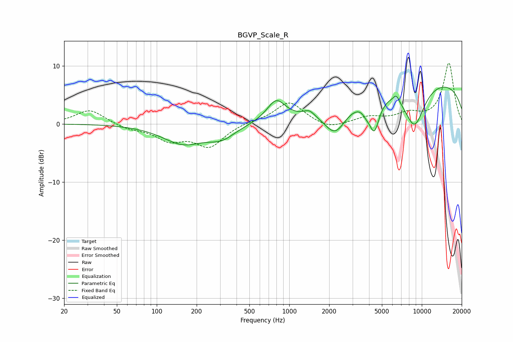

# BGVP_Scale_R
See [usage instructions](https://github.com/jaakkopasanen/AutoEq#usage) for more options and info.

### Parametric EQs
Apply preamp of -6.4 dB when using parametric equalizer.

|   # | Type    |   Fc (Hz) |    Q |   Gain (dB) |
|-----|---------|-----------|------|-------------|
|   1 | Peaking |       159 | 0.9  |        -3.3 |
|   2 | Peaking |       309 | 1.39 |        -2   |
|   3 | Peaking |       796 | 2.02 |         3.7 |
|   4 | Peaking |      1414 | 3.52 |         1.1 |
|   5 | Peaking |      2221 | 1.67 |        -4.9 |
|   6 | Peaking |      3792 | 5.27 |        -0.8 |
|   7 | Peaking |      4375 | 3.47 |        -5.9 |
|   8 | Peaking |      6419 | 6    |         1.2 |
|   9 | Peaking |      8798 | 1.61 |        -7.5 |
|  10 | Peaking |     10000 | 0.19 |         7.7 |

### Fixed Band EQs
When using fixed band (also called graphic) equalizer, apply preamp of **-10.6 dB** (if available) and set gains manually with these parameters.

|   # | Type    |   Fc (Hz) |    Q |   Gain (dB) |
|-----|---------|-----------|------|-------------|
|   1 | Peaking |        31 | 1.41 |         2.5 |
|   2 | Peaking |        62 | 1.41 |        -0.8 |
|   3 | Peaking |       125 | 1.41 |        -2.6 |
|   4 | Peaking |       250 | 1.41 |        -3.8 |
|   5 | Peaking |       500 | 1.41 |         0.4 |
|   6 | Peaking |      1000 | 1.41 |         3.8 |
|   7 | Peaking |      2000 | 1.41 |        -1.1 |
|   8 | Peaking |      4000 | 1.41 |         1.1 |
|   9 | Peaking |      8000 | 1.41 |         1.5 |
|  10 | Peaking |     16000 | 1.41 |        10.4 |

### Graphs

