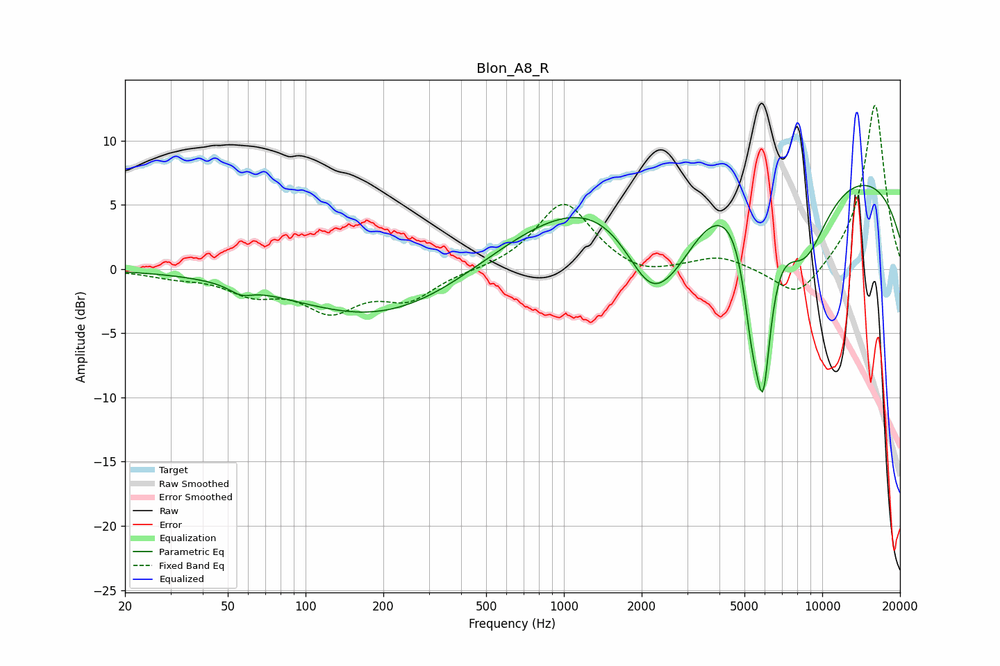

# Blon_A8_R
See [usage instructions](https://github.com/jaakkopasanen/AutoEq#usage) for more options and info.

### Parametric EQs
Apply preamp of -6.6 dB when using parametric equalizer.

|   # | Type    |   Fc (Hz) |    Q |   Gain (dB) |
|-----|---------|-----------|------|-------------|
|   1 | Peaking |        56 | 3.27 |        -0.7 |
|   2 | Peaking |       118 | 2.57 |         0   |
|   3 | Peaking |       205 | 0.4  |        -4.1 |
|   4 | Peaking |      1607 | 0.31 |         5.7 |
|   5 | Peaking |      2164 | 1.23 |        -7.1 |
|   6 | Peaking |      2764 | 1.14 |        -4.1 |
|   7 | Peaking |      5334 | 3.96 |        -6   |
|   8 | Peaking |      5904 | 4.12 |       -11.9 |
|   9 | Peaking |      8518 | 1.27 |        -6.8 |
|  10 | Peaking |      9464 | 0.19 |         8.2 |

### Fixed Band EQs
When using fixed band (also called graphic) equalizer, apply preamp of **-12.8 dB** (if available) and set gains manually with these parameters.

|   # | Type    |   Fc (Hz) |    Q |   Gain (dB) |
|-----|---------|-----------|------|-------------|
|   1 | Peaking |        31 | 1.41 |        -0.5 |
|   2 | Peaking |        62 | 1.41 |        -1.6 |
|   3 | Peaking |       125 | 1.41 |        -2.9 |
|   4 | Peaking |       250 | 1.41 |        -2.1 |
|   5 | Peaking |       500 | 1.41 |        -0.1 |
|   6 | Peaking |      1000 | 1.41 |         5.3 |
|   7 | Peaking |      2000 | 1.41 |        -0.8 |
|   8 | Peaking |      4000 | 1.41 |         1   |
|   9 | Peaking |      8000 | 1.41 |        -2.6 |
|  10 | Peaking |     16000 | 1.41 |        13   |

### Graphs

