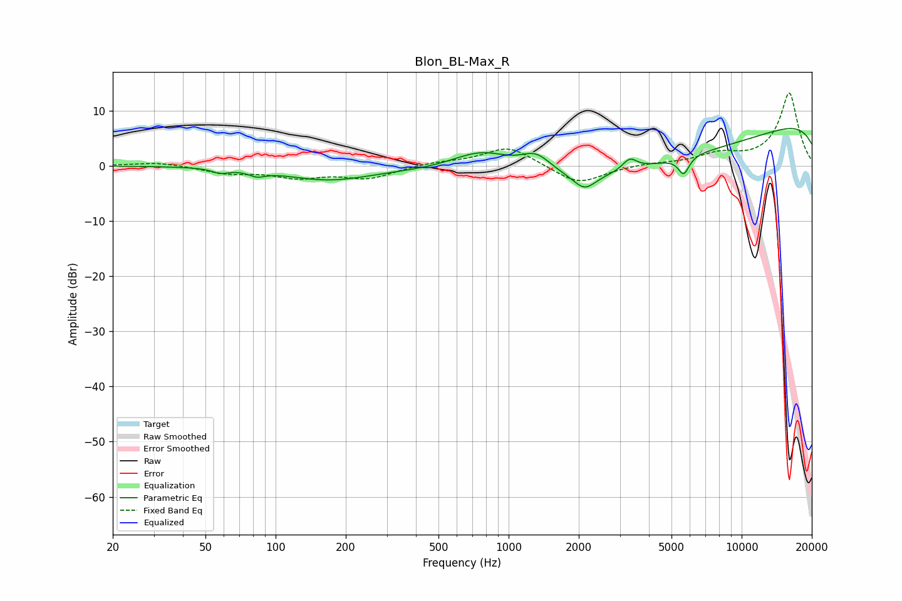

# Blon_BL-Max_R
See [usage instructions](https://github.com/jaakkopasanen/AutoEq#usage) for more options and info.

### Parametric EQs
Apply preamp of -6.8 dB when using parametric equalizer.

|   # | Type    |   Fc (Hz) |    Q |   Gain (dB) |
|-----|---------|-----------|------|-------------|
|   1 | Peaking |        58 | 4.25 |        -0.8 |
|   2 | Peaking |        83 | 4.07 |        -0.9 |
|   3 | Peaking |       168 | 0.78 |        -2.4 |
|   4 | Peaking |       774 | 0.99 |         5.1 |
|   5 | Peaking |      1315 | 1.99 |         3.7 |
|   6 | Peaking |      2120 | 3.01 |        -2.7 |
|   7 | Peaking |      3309 | 4.56 |         2.1 |
|   8 | Peaking |      4250 | 0.19 |       -10   |
|   9 | Peaking |      5640 | 6    |        -3.2 |
|  10 | Peaking |     10000 | 0.18 |        12.6 |

### Fixed Band EQs
When using fixed band (also called graphic) equalizer, apply preamp of **-13.3 dB** (if available) and set gains manually with these parameters.

|   # | Type    |   Fc (Hz) |    Q |   Gain (dB) |
|-----|---------|-----------|------|-------------|
|   1 | Peaking |        31 | 1.41 |         0.7 |
|   2 | Peaking |        62 | 1.41 |        -1.2 |
|   3 | Peaking |       125 | 1.41 |        -1.9 |
|   4 | Peaking |       250 | 1.41 |        -2.2 |
|   5 | Peaking |       500 | 1.41 |         0.6 |
|   6 | Peaking |      1000 | 1.41 |         3.6 |
|   7 | Peaking |      2000 | 1.41 |        -3.5 |
|   8 | Peaking |      4000 | 1.41 |         0.4 |
|   9 | Peaking |      8000 | 1.41 |         1.8 |
|  10 | Peaking |     16000 | 1.41 |        13.2 |

### Graphs

