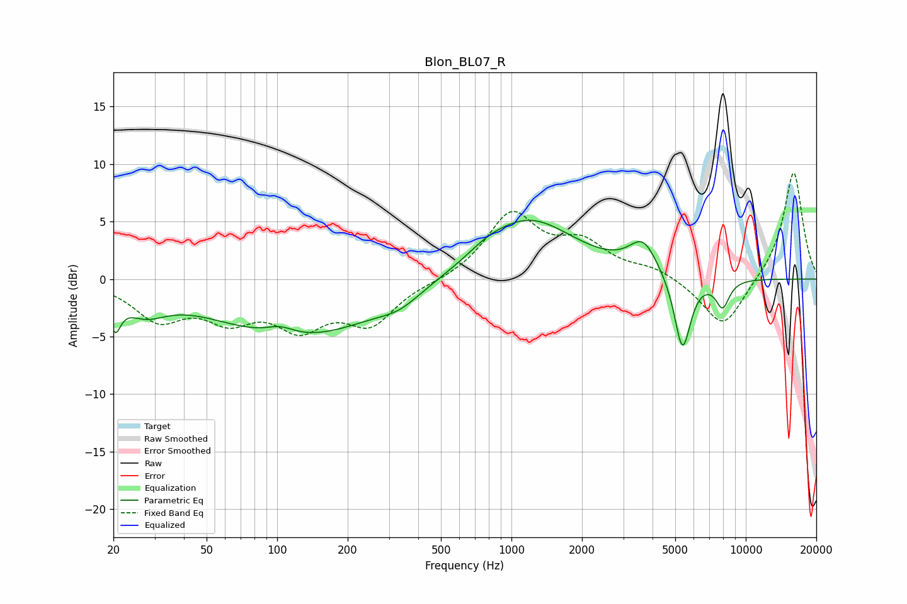

# Blon_BL07_R
See [usage instructions](https://github.com/jaakkopasanen/AutoEq#usage) for more options and info.

### Parametric EQs
Apply preamp of -5.2 dB when using parametric equalizer.

|   # | Type    |   Fc (Hz) |    Q |   Gain (dB) |
|-----|---------|-----------|------|-------------|
|   1 | Peaking |        20 | 5.94 |        -2.7 |
|   2 | Peaking |        27 | 1.54 |        -2   |
|   3 | Peaking |       103 | 2.26 |         0.8 |
|   4 | Peaking |       122 | 0.4  |        -5   |
|   5 | Peaking |       332 | 1.65 |        -0.9 |
|   6 | Peaking |       784 | 1.95 |         0.5 |
|   7 | Peaking |      1171 | 0.7  |         5.3 |
|   8 | Peaking |      3650 | 2.34 |         2.7 |
|   9 | Peaking |      5370 | 3.93 |        -6.7 |
|  10 | Peaking |      7960 | 4.47 |        -2.4 |

### Fixed Band EQs
When using fixed band (also called graphic) equalizer, apply preamp of **-9.3 dB** (if available) and set gains manually with these parameters.

|   # | Type    |   Fc (Hz) |    Q |   Gain (dB) |
|-----|---------|-----------|------|-------------|
|   1 | Peaking |        31 | 1.41 |        -3.2 |
|   2 | Peaking |        62 | 1.41 |        -2.9 |
|   3 | Peaking |       125 | 1.41 |        -3.6 |
|   4 | Peaking |       250 | 1.41 |        -3.6 |
|   5 | Peaking |       500 | 1.41 |        -0.2 |
|   6 | Peaking |      1000 | 1.41 |         5.6 |
|   7 | Peaking |      2000 | 1.41 |         2.7 |
|   8 | Peaking |      4000 | 1.41 |         0.9 |
|   9 | Peaking |      8000 | 1.41 |        -4.4 |
|  10 | Peaking |     16000 | 1.41 |         9.5 |

### Graphs

