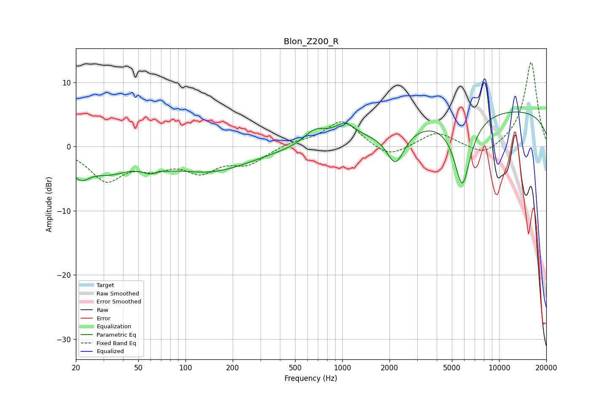

# Blon_Z200_R
See [usage instructions](https://github.com/jaakkopasanen/AutoEq#usage) for more options and info.

### Parametric EQs
Apply preamp of -5.5 dB when using parametric equalizer.

|   # | Type    |   Fc (Hz) |    Q |   Gain (dB) |
|-----|---------|-----------|------|-------------|
|   1 | Peaking |        21 | 2.16 |        -3.5 |
|   2 | Peaking |        33 | 1.12 |        -2.9 |
|   3 | Peaking |        65 | 2.29 |        -3.7 |
|   4 | Peaking |        66 | 2.96 |         2.5 |
|   5 | Peaking |       144 | 0.54 |        -3.7 |
|   6 | Peaking |       670 | 1.94 |         2.3 |
|   7 | Peaking |      1039 | 2.09 |         2.5 |
|   8 | Peaking |      2187 | 2.47 |        -5.3 |
|   9 | Peaking |      5826 | 2.56 |       -11.1 |
|  10 | Peaking |      9788 | 0.18 |         5.9 |

### Fixed Band EQs
When using fixed band (also called graphic) equalizer, apply preamp of **-13.2 dB** (if available) and set gains manually with these parameters.

|   # | Type    |   Fc (Hz) |    Q |   Gain (dB) |
|-----|---------|-----------|------|-------------|
|   1 | Peaking |        31 | 1.41 |        -5   |
|   2 | Peaking |        62 | 1.41 |        -2.5 |
|   3 | Peaking |       125 | 1.41 |        -3.4 |
|   4 | Peaking |       250 | 1.41 |        -2.5 |
|   5 | Peaking |       500 | 1.41 |         0.7 |
|   6 | Peaking |      1000 | 1.41 |         4.1 |
|   7 | Peaking |      2000 | 1.41 |        -2   |
|   8 | Peaking |      4000 | 1.41 |         2.3 |
|   9 | Peaking |      8000 | 1.41 |        -1.8 |
|  10 | Peaking |     16000 | 1.41 |        13.3 |

### Graphs

