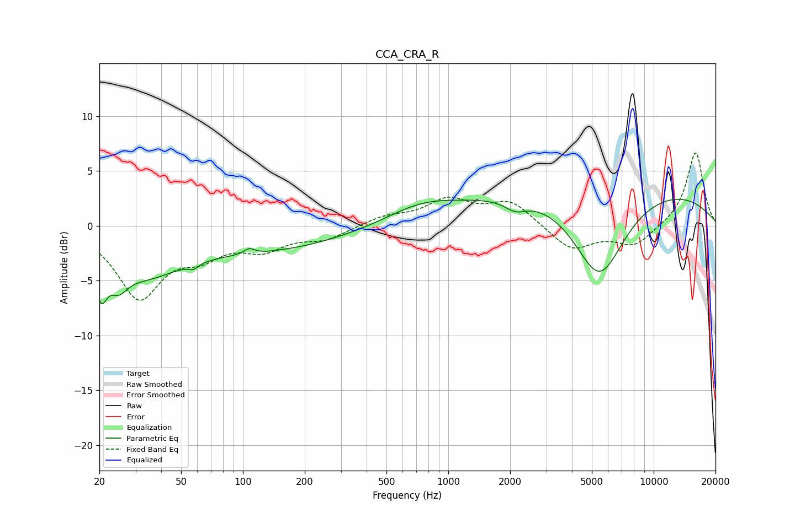

# CCA_CRA_R
See [usage instructions](https://github.com/jaakkopasanen/AutoEq#usage) for more options and info.

### Parametric EQs
Apply preamp of -2.5 dB when using parametric equalizer.

|   # | Type    |   Fc (Hz) |    Q |   Gain (dB) |
|-----|---------|-----------|------|-------------|
|   1 | Peaking |        20 | 5.07 |        -3.6 |
|   2 | Peaking |        25 | 3.09 |        -2.1 |
|   3 | Peaking |        33 | 0.8  |        -3.5 |
|   4 | Peaking |        57 | 5.89 |        -0.5 |
|   5 | Peaking |       107 | 5.66 |         0.5 |
|   6 | Peaking |       125 | 0.34 |        -2.1 |
|   7 | Peaking |       728 | 0.82 |         1.4 |
|   8 | Peaking |      2124 | 2.68 |        -0.9 |
|   9 | Peaking |      5436 | 1.1  |        -8.1 |
|  10 | Peaking |      5882 | 0.18 |         3.9 |

### Fixed Band EQs
When using fixed band (also called graphic) equalizer, apply preamp of **-6.7 dB** (if available) and set gains manually with these parameters.

|   # | Type    |   Fc (Hz) |    Q |   Gain (dB) |
|-----|---------|-----------|------|-------------|
|   1 | Peaking |        31 | 1.41 |        -6.3 |
|   2 | Peaking |        62 | 1.41 |        -2.1 |
|   3 | Peaking |       125 | 1.41 |        -1.8 |
|   4 | Peaking |       250 | 1.41 |        -1.1 |
|   5 | Peaking |       500 | 1.41 |         0.8 |
|   6 | Peaking |      1000 | 1.41 |         2.2 |
|   7 | Peaking |      2000 | 1.41 |         2.2 |
|   8 | Peaking |      4000 | 1.41 |        -2.3 |
|   9 | Peaking |      8000 | 1.41 |        -1.8 |
|  10 | Peaking |     16000 | 1.41 |         6.8 |

### Graphs

