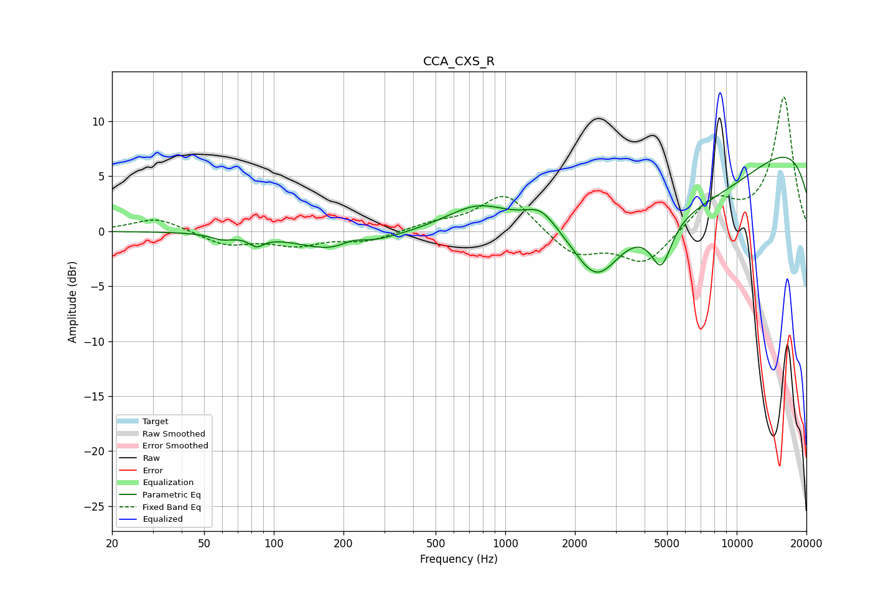

# CCA_CXS_R
See [usage instructions](https://github.com/jaakkopasanen/AutoEq#usage) for more options and info.

### Parametric EQs
Apply preamp of -6.8 dB when using parametric equalizer.

|   # | Type    |   Fc (Hz) |    Q |   Gain (dB) |
|-----|---------|-----------|------|-------------|
|   1 | Peaking |        60 | 3.04 |        -0.5 |
|   2 | Peaking |        84 | 4.41 |        -0.8 |
|   3 | Peaking |       197 | 0.88 |        -2.1 |
|   4 | Peaking |       220 | 2.27 |         0.9 |
|   5 | Peaking |       755 | 1.07 |         2.1 |
|   6 | Peaking |      1423 | 2.16 |         1.6 |
|   7 | Peaking |      2475 | 1.35 |        -5.7 |
|   8 | Peaking |      4722 | 3.1  |        -4.2 |
|   9 | Peaking |      6251 | 0.34 |        -7.8 |
|  10 | Peaking |      9754 | 0.18 |        11.2 |

### Fixed Band EQs
When using fixed band (also called graphic) equalizer, apply preamp of **-12.3 dB** (if available) and set gains manually with these parameters.

|   # | Type    |   Fc (Hz) |    Q |   Gain (dB) |
|-----|---------|-----------|------|-------------|
|   1 | Peaking |        31 | 1.41 |         1.3 |
|   2 | Peaking |        62 | 1.41 |        -1.2 |
|   3 | Peaking |       125 | 1.41 |        -1.1 |
|   4 | Peaking |       250 | 1.41 |        -0.9 |
|   5 | Peaking |       500 | 1.41 |         0.6 |
|   6 | Peaking |      1000 | 1.41 |         3.5 |
|   7 | Peaking |      2000 | 1.41 |        -2.3 |
|   8 | Peaking |      4000 | 1.41 |        -3   |
|   9 | Peaking |      8000 | 1.41 |         2.8 |
|  10 | Peaking |     16000 | 1.41 |        12.2 |

### Graphs

