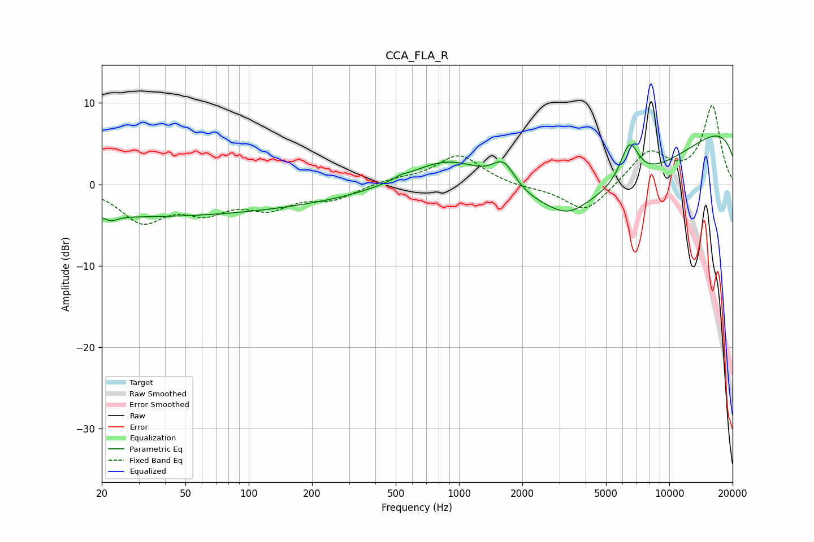

# CCA_FLA_R
See [usage instructions](https://github.com/jaakkopasanen/AutoEq#usage) for more options and info.

### Parametric EQs
Apply preamp of -6.0 dB when using parametric equalizer.

|   # | Type    |   Fc (Hz) |    Q |   Gain (dB) |
|-----|---------|-----------|------|-------------|
|   1 | Peaking |        22 | 5.17 |        -0.5 |
|   2 | Peaking |        24 | 0.18 |        -3.9 |
|   3 | Peaking |       530 | 5.46 |         0.3 |
|   4 | Peaking |       589 | 0.2  |        -2.2 |
|   5 | Peaking |       922 | 0.62 |         6.9 |
|   6 | Peaking |      1630 | 2.53 |         3.3 |
|   7 | Peaking |      3294 | 1.63 |        -1.6 |
|   8 | Peaking |      4847 | 0.25 |       -11   |
|   9 | Peaking |      6458 | 3.06 |         4.9 |
|  10 | Peaking |     10000 | 0.18 |        11.4 |

### Fixed Band EQs
When using fixed band (also called graphic) equalizer, apply preamp of **-9.8 dB** (if available) and set gains manually with these parameters.

|   # | Type    |   Fc (Hz) |    Q |   Gain (dB) |
|-----|---------|-----------|------|-------------|
|   1 | Peaking |        31 | 1.41 |        -4.3 |
|   2 | Peaking |        62 | 1.41 |        -2.8 |
|   3 | Peaking |       125 | 1.41 |        -2.5 |
|   4 | Peaking |       250 | 1.41 |        -1.6 |
|   5 | Peaking |       500 | 1.41 |         0.6 |
|   6 | Peaking |      1000 | 1.41 |         3.6 |
|   7 | Peaking |      2000 | 1.41 |        -0.4 |
|   8 | Peaking |      4000 | 1.41 |        -3.6 |
|   9 | Peaking |      8000 | 1.41 |         4   |
|  10 | Peaking |     16000 | 1.41 |         9.6 |

### Graphs

