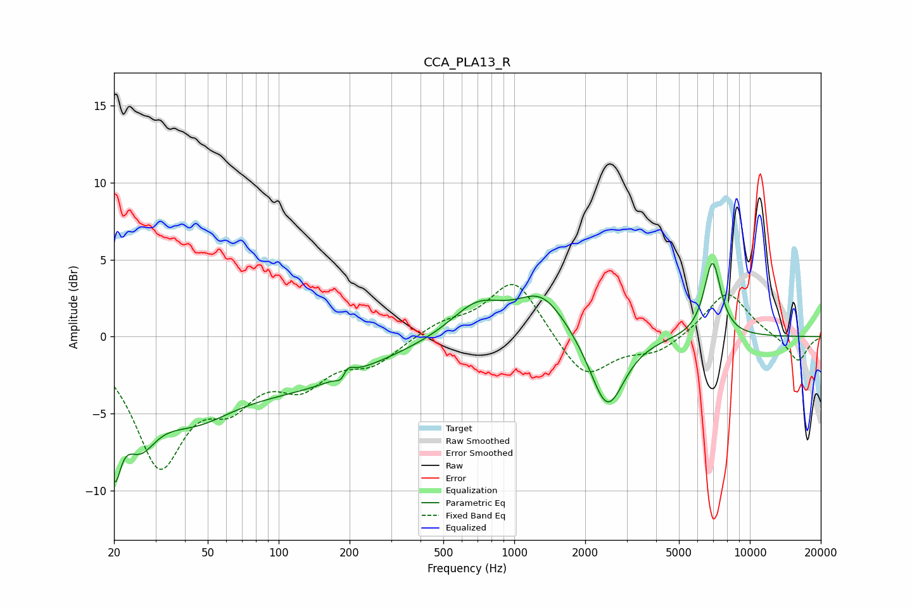

# CCA_PLA13_R
See [usage instructions](https://github.com/jaakkopasanen/AutoEq#usage) for more options and info.

### Parametric EQs
Apply preamp of -4.8 dB when using parametric equalizer.

|   # | Type    |   Fc (Hz) |    Q |   Gain (dB) |
|-----|---------|-----------|------|-------------|
|   1 | Peaking |        20 | 5.01 |        -5.4 |
|   2 | Peaking |        25 | 1.92 |        -3.9 |
|   3 | Peaking |        42 | 0.74 |        -4   |
|   4 | Peaking |       127 | 0.45 |        -2.7 |
|   5 | Peaking |       187 | 5.79 |        -3.2 |
|   6 | Peaking |       190 | 5.39 |         3.3 |
|   7 | Peaking |       696 | 1.24 |         2.2 |
|   8 | Peaking |      1310 | 1.32 |         2.7 |
|   9 | Peaking |      2482 | 1.95 |        -5   |
|  10 | Peaking |      6939 | 3.78 |         4.9 |

### Fixed Band EQs
When using fixed band (also called graphic) equalizer, apply preamp of **-3.5 dB** (if available) and set gains manually with these parameters.

|   # | Type    |   Fc (Hz) |    Q |   Gain (dB) |
|-----|---------|-----------|------|-------------|
|   1 | Peaking |        31 | 1.41 |        -7.9 |
|   2 | Peaking |        62 | 1.41 |        -3.2 |
|   3 | Peaking |       125 | 1.41 |        -2.6 |
|   4 | Peaking |       250 | 1.41 |        -1.6 |
|   5 | Peaking |       500 | 1.41 |         0.8 |
|   6 | Peaking |      1000 | 1.41 |         3.8 |
|   7 | Peaking |      2000 | 1.41 |        -2.8 |
|   8 | Peaking |      4000 | 1.41 |        -1   |
|   9 | Peaking |      8000 | 1.41 |         3   |
|  10 | Peaking |     16000 | 1.41 |        -1.7 |

### Graphs

