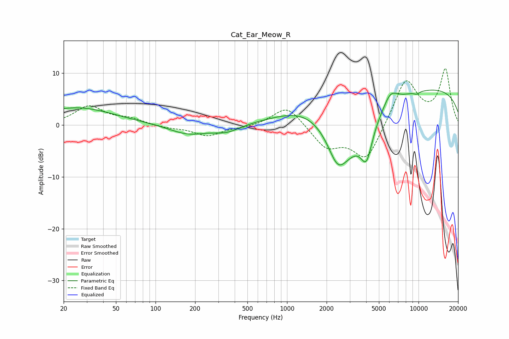

# Cat_Ear_Meow_R
See [usage instructions](https://github.com/jaakkopasanen/AutoEq#usage) for more options and info.

### Parametric EQs
Apply preamp of -6.8 dB when using parametric equalizer.

|   # | Type    |   Fc (Hz) |    Q |   Gain (dB) |
|-----|---------|-----------|------|-------------|
|   1 | Peaking |        25 | 0.5  |         3.3 |
|   2 | Peaking |       177 | 0.99 |        -1.9 |
|   3 | Peaking |       348 | 1.36 |        -1.4 |
|   4 | Peaking |      1541 | 0.58 |         4.6 |
|   5 | Peaking |      2420 | 2.11 |        -4.6 |
|   6 | Peaking |      2773 | 0.74 |       -10.7 |
|   7 | Peaking |      4021 | 3.15 |        -6.5 |
|   8 | Peaking |      6125 | 2.49 |         2.8 |
|   9 | Peaking |      9674 | 5.99 |        -0.5 |
|  10 | Peaking |      9909 | 0.18 |         7.4 |

### Fixed Band EQs
When using fixed band (also called graphic) equalizer, apply preamp of **-11.0 dB** (if available) and set gains manually with these parameters.

|   # | Type    |   Fc (Hz) |    Q |   Gain (dB) |
|-----|---------|-----------|------|-------------|
|   1 | Peaking |        31 | 1.41 |         3.5 |
|   2 | Peaking |        62 | 1.41 |         1.1 |
|   3 | Peaking |       125 | 1.41 |        -0.5 |
|   4 | Peaking |       250 | 1.41 |        -2.1 |
|   5 | Peaking |       500 | 1.41 |        -0.4 |
|   6 | Peaking |      1000 | 1.41 |         3.9 |
|   7 | Peaking |      2000 | 1.41 |        -4.2 |
|   8 | Peaking |      4000 | 1.41 |        -7   |
|   9 | Peaking |      8000 | 1.41 |         9   |
|  10 | Peaking |     16000 | 1.41 |        10.5 |

### Graphs

