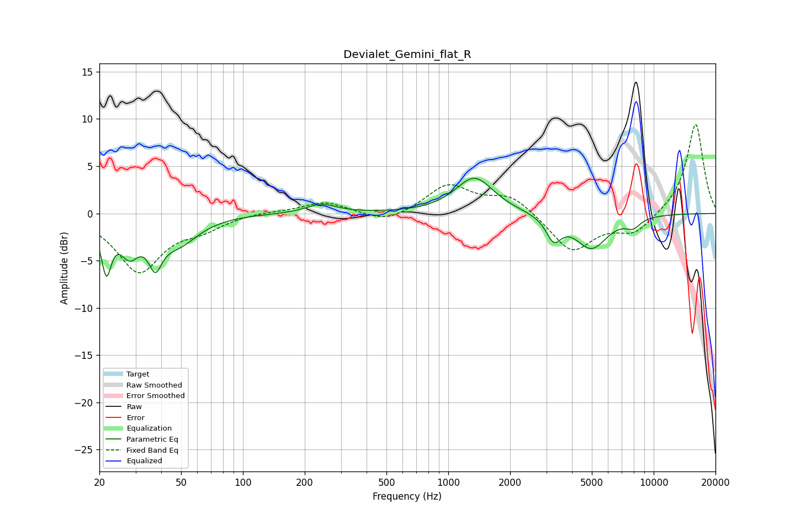

# Devialet_Gemini_flat_R
See [usage instructions](https://github.com/jaakkopasanen/AutoEq#usage) for more options and info.

### Parametric EQs
Apply preamp of -3.8 dB when using parametric equalizer.

|   # | Type    |   Fc (Hz) |    Q |   Gain (dB) |
|-----|---------|-----------|------|-------------|
|   1 | Peaking |        22 | 5.86 |        -5.3 |
|   2 | Peaking |        28 | 3.15 |        -3.3 |
|   3 | Peaking |        37 | 6    |         2.4 |
|   4 | Peaking |        37 | 4.94 |        -5.9 |
|   5 | Peaking |        48 | 1.43 |        -2.9 |
|   6 | Peaking |       242 | 1.91 |         1   |
|   7 | Peaking |      1341 | 1.54 |         3.8 |
|   8 | Peaking |      3260 | 3.88 |        -2.4 |
|   9 | Peaking |      4973 | 1.77 |        -3.6 |
|  10 | Peaking |      7932 | 3.64 |        -1   |

### Fixed Band EQs
When using fixed band (also called graphic) equalizer, apply preamp of **-9.5 dB** (if available) and set gains manually with these parameters.

|   # | Type    |   Fc (Hz) |    Q |   Gain (dB) |
|-----|---------|-----------|------|-------------|
|   1 | Peaking |        31 | 1.41 |        -6.1 |
|   2 | Peaking |        62 | 1.41 |        -1.3 |
|   3 | Peaking |       125 | 1.41 |         0.2 |
|   4 | Peaking |       250 | 1.41 |         1.2 |
|   5 | Peaking |       500 | 1.41 |        -1.1 |
|   6 | Peaking |      1000 | 1.41 |         3   |
|   7 | Peaking |      2000 | 1.41 |         1.9 |
|   8 | Peaking |      4000 | 1.41 |        -4.1 |
|   9 | Peaking |      8000 | 1.41 |        -2   |
|  10 | Peaking |     16000 | 1.41 |         9.6 |

### Graphs

