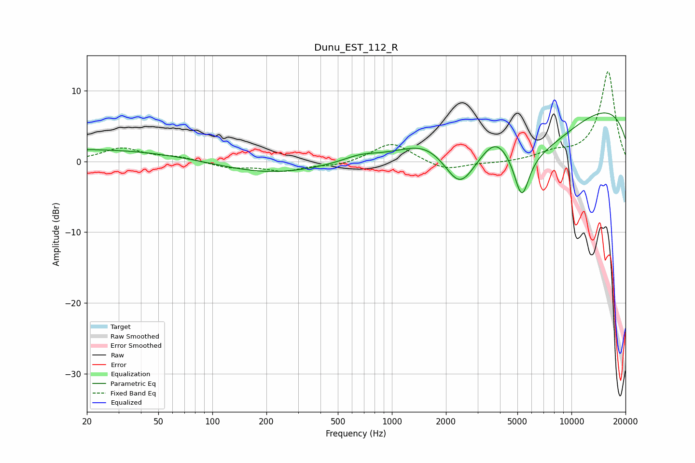

# Dunu_EST_112_R
See [usage instructions](https://github.com/jaakkopasanen/AutoEq#usage) for more options and info.

### Parametric EQs
Apply preamp of -6.9 dB when using parametric equalizer.

|   # | Type    |   Fc (Hz) |    Q |   Gain (dB) |
|-----|---------|-----------|------|-------------|
|   1 | Peaking |        20 | 2.7  |         0   |
|   2 | Peaking |        23 | 0.29 |         1.7 |
|   3 | Peaking |       210 | 0.5  |        -1.8 |
|   4 | Peaking |       666 | 1.52 |         0.8 |
|   5 | Peaking |      1551 | 1.07 |         1.7 |
|   6 | Peaking |      2391 | 1.56 |        -6.1 |
|   7 | Peaking |      3796 | 1.81 |         2.7 |
|   8 | Peaking |      5289 | 3.31 |        -6.5 |
|   9 | Peaking |      6035 | 0.51 |        -6.9 |
|  10 | Peaking |     10000 | 0.18 |         9.3 |

### Fixed Band EQs
When using fixed band (also called graphic) equalizer, apply preamp of **-12.8 dB** (if available) and set gains manually with these parameters.

|   # | Type    |   Fc (Hz) |    Q |   Gain (dB) |
|-----|---------|-----------|------|-------------|
|   1 | Peaking |        31 | 1.41 |         1.8 |
|   2 | Peaking |        62 | 1.41 |         0.6 |
|   3 | Peaking |       125 | 1.41 |        -0.8 |
|   4 | Peaking |       250 | 1.41 |        -1.2 |
|   5 | Peaking |       500 | 1.41 |        -0.6 |
|   6 | Peaking |      1000 | 1.41 |         2.8 |
|   7 | Peaking |      2000 | 1.41 |        -1.3 |
|   8 | Peaking |      4000 | 1.41 |        -0.2 |
|   9 | Peaking |      8000 | 1.41 |         1.1 |
|  10 | Peaking |     16000 | 1.41 |        12.7 |

### Graphs

