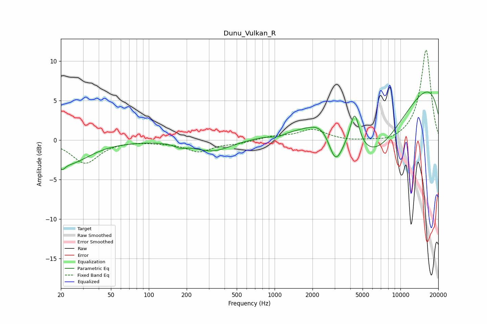

# Dunu_Vulkan_R
See [usage instructions](https://github.com/jaakkopasanen/AutoEq#usage) for more options and info.

### Parametric EQs
Apply preamp of -6.2 dB when using parametric equalizer.

|   # | Type    |   Fc (Hz) |    Q |   Gain (dB) |
|-----|---------|-----------|------|-------------|
|   1 | Peaking |        20 | 5.99 |        -0.9 |
|   2 | Peaking |        23 | 0.85 |        -2.9 |
|   3 | Peaking |       177 | 3.11 |        -0.4 |
|   4 | Peaking |       323 | 0.97 |        -1.5 |
|   5 | Peaking |      1063 | 3.02 |        -0.4 |
|   6 | Peaking |      2617 | 1.15 |         2.9 |
|   7 | Peaking |      3031 | 2.29 |        -4.9 |
|   8 | Peaking |      4324 | 3.79 |         4.5 |
|   9 | Peaking |      6031 | 0.38 |       -13.3 |
|  10 | Peaking |      9067 | 0.18 |        12.3 |

### Fixed Band EQs
When using fixed band (also called graphic) equalizer, apply preamp of **-11.5 dB** (if available) and set gains manually with these parameters.

|   # | Type    |   Fc (Hz) |    Q |   Gain (dB) |
|-----|---------|-----------|------|-------------|
|   1 | Peaking |        31 | 1.41 |        -2.9 |
|   2 | Peaking |        62 | 1.41 |        -0   |
|   3 | Peaking |       125 | 1.41 |        -0.2 |
|   4 | Peaking |       250 | 1.41 |        -1.4 |
|   5 | Peaking |       500 | 1.41 |        -0.4 |
|   6 | Peaking |      1000 | 1.41 |         0.4 |
|   7 | Peaking |      2000 | 1.41 |         1.3 |
|   8 | Peaking |      4000 | 1.41 |        -0.2 |
|   9 | Peaking |      8000 | 1.41 |        -0.4 |
|  10 | Peaking |     16000 | 1.41 |        11.5 |

### Graphs

