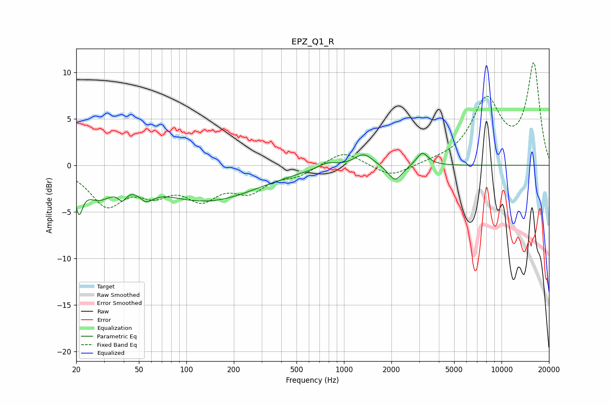

# EPZ_Q1_R
See [usage instructions](https://github.com/jaakkopasanen/AutoEq#usage) for more options and info.

### Parametric EQs
Apply preamp of -1.4 dB when using parametric equalizer.

|   # | Type    |   Fc (Hz) |    Q |   Gain (dB) |
|-----|---------|-----------|------|-------------|
|   1 | Peaking |        21 | 5.98 |        -3.3 |
|   2 | Peaking |        28 | 1.57 |        -2.7 |
|   3 | Peaking |        39 | 5.55 |        -1.1 |
|   4 | Peaking |        56 | 4.1  |        -3.9 |
|   5 | Peaking |        57 | 4.67 |         2.7 |
|   6 | Peaking |       134 | 0.43 |        -3.8 |
|   7 | Peaking |       783 | 2.37 |         0.6 |
|   8 | Peaking |      1334 | 2.39 |         1.4 |
|   9 | Peaking |      2115 | 3.2  |        -1.8 |
|  10 | Peaking |      3144 | 3.81 |         1.5 |

### Fixed Band EQs
When using fixed band (also called graphic) equalizer, apply preamp of **-11.1 dB** (if available) and set gains manually with these parameters.

|   # | Type    |   Fc (Hz) |    Q |   Gain (dB) |
|-----|---------|-----------|------|-------------|
|   1 | Peaking |        31 | 1.41 |        -4   |
|   2 | Peaking |        62 | 1.41 |        -2.4 |
|   3 | Peaking |       125 | 1.41 |        -3.1 |
|   4 | Peaking |       250 | 1.41 |        -2.4 |
|   5 | Peaking |       500 | 1.41 |        -1   |
|   6 | Peaking |      1000 | 1.41 |         1.6 |
|   7 | Peaking |      2000 | 1.41 |        -1.3 |
|   8 | Peaking |      4000 | 1.41 |         0.2 |
|   9 | Peaking |      8000 | 1.41 |         6.8 |
|  10 | Peaking |     16000 | 1.41 |        10.7 |

### Graphs

