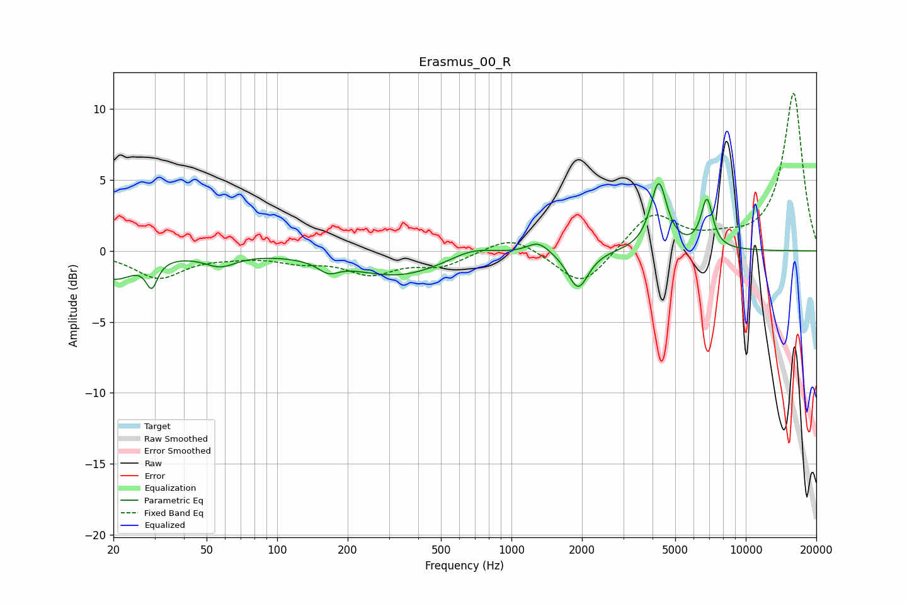

# Erasmus_00_R
See [usage instructions](https://github.com/jaakkopasanen/AutoEq#usage) for more options and info.

### Parametric EQs
Apply preamp of -4.8 dB when using parametric equalizer.

|   # | Type    |   Fc (Hz) |    Q |   Gain (dB) |
|-----|---------|-----------|------|-------------|
|   1 | Peaking |        20 | 1.65 |        -1.9 |
|   2 | Peaking |        29 | 5.99 |        -1.8 |
|   3 | Peaking |        57 | 2.08 |        -0.9 |
|   4 | Peaking |       165 | 3.25 |        -0.7 |
|   5 | Peaking |       328 | 0.7  |        -1.7 |
|   6 | Peaking |       679 | 1.5  |         0.7 |
|   7 | Peaking |      1303 | 2.95 |         0.8 |
|   8 | Peaking |      1925 | 3.26 |        -2.7 |
|   9 | Peaking |      4251 | 4.05 |         4.7 |
|  10 | Peaking |      6826 | 5.43 |         3.4 |

### Fixed Band EQs
When using fixed band (also called graphic) equalizer, apply preamp of **-11.2 dB** (if available) and set gains manually with these parameters.

|   # | Type    |   Fc (Hz) |    Q |   Gain (dB) |
|-----|---------|-----------|------|-------------|
|   1 | Peaking |        31 | 1.41 |        -1.9 |
|   2 | Peaking |        62 | 1.41 |        -0.2 |
|   3 | Peaking |       125 | 1.41 |        -0.6 |
|   4 | Peaking |       250 | 1.41 |        -1.5 |
|   5 | Peaking |       500 | 1.41 |        -1   |
|   6 | Peaking |      1000 | 1.41 |         1.2 |
|   7 | Peaking |      2000 | 1.41 |        -2.6 |
|   8 | Peaking |      4000 | 1.41 |         2.7 |
|   9 | Peaking |      8000 | 1.41 |         0.6 |
|  10 | Peaking |     16000 | 1.41 |        11.1 |

### Graphs

