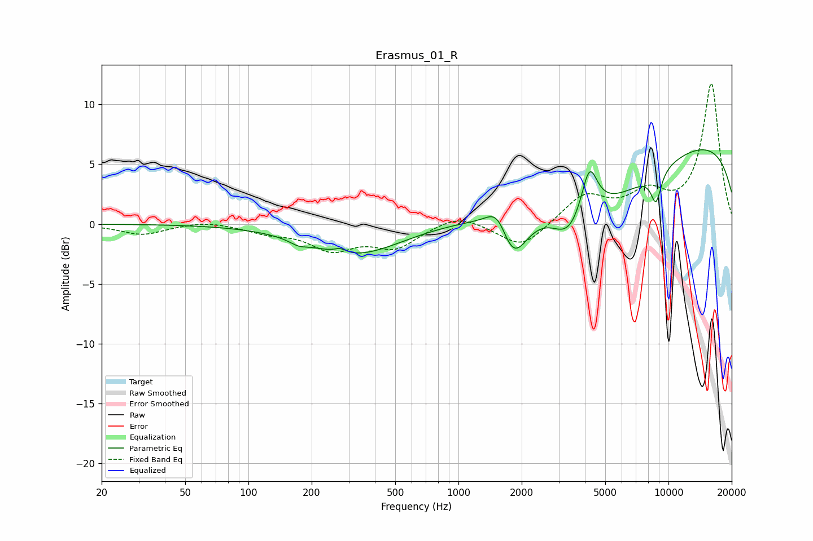

# Erasmus_01_R
See [usage instructions](https://github.com/jaakkopasanen/AutoEq#usage) for more options and info.

### Parametric EQs
Apply preamp of -6.3 dB when using parametric equalizer.

|   # | Type    |   Fc (Hz) |    Q |   Gain (dB) |
|-----|---------|-----------|------|-------------|
|   1 | Peaking |       173 | 3.31 |        -0.4 |
|   2 | Peaking |       274 | 4.85 |         0.4 |
|   3 | Peaking |       321 | 0.66 |        -2.6 |
|   4 | Peaking |      1545 | 2.63 |         2.4 |
|   5 | Peaking |      1806 | 2    |        -4.5 |
|   6 | Peaking |      3347 | 1.84 |        -2.6 |
|   7 | Peaking |      4201 | 3.71 |         3.9 |
|   8 | Peaking |      5293 | 0.5  |        -4.5 |
|   9 | Peaking |      8724 | 5.23 |        -2.5 |
|  10 | Peaking |     10000 | 0.18 |         7.7 |

### Fixed Band EQs
When using fixed band (also called graphic) equalizer, apply preamp of **-11.8 dB** (if available) and set gains manually with these parameters.

|   # | Type    |   Fc (Hz) |    Q |   Gain (dB) |
|-----|---------|-----------|------|-------------|
|   1 | Peaking |        31 | 1.41 |        -0.9 |
|   2 | Peaking |        62 | 1.41 |         0.3 |
|   3 | Peaking |       125 | 1.41 |        -0.6 |
|   4 | Peaking |       250 | 1.41 |        -2   |
|   5 | Peaking |       500 | 1.41 |        -1.8 |
|   6 | Peaking |      1000 | 1.41 |         0.9 |
|   7 | Peaking |      2000 | 1.41 |        -2.1 |
|   8 | Peaking |      4000 | 1.41 |         2.4 |
|   9 | Peaking |      8000 | 1.41 |         2.2 |
|  10 | Peaking |     16000 | 1.41 |        11.7 |

### Graphs

