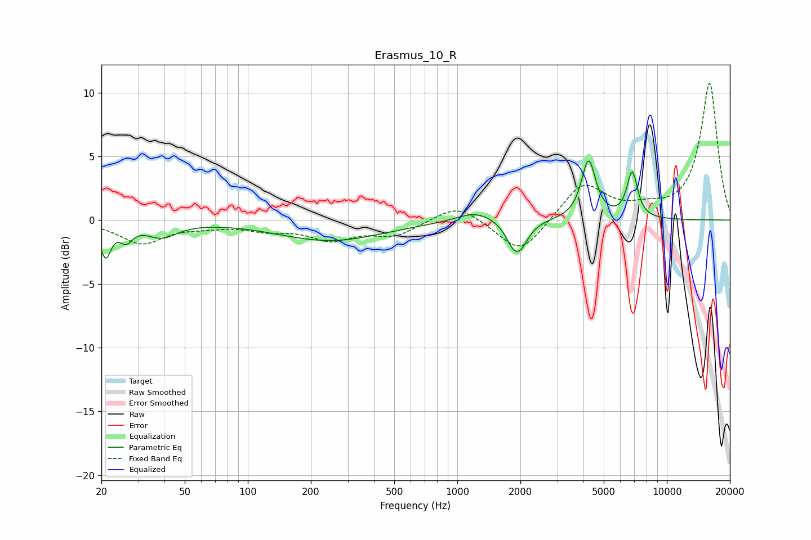

# Erasmus_10_R
See [usage instructions](https://github.com/jaakkopasanen/AutoEq#usage) for more options and info.

### Parametric EQs
Apply preamp of -4.7 dB when using parametric equalizer.

|   # | Type    |   Fc (Hz) |    Q |   Gain (dB) |
|-----|---------|-----------|------|-------------|
|   1 | Peaking |        21 | 5.6  |        -2.6 |
|   2 | Peaking |        26 | 4.77 |        -1.2 |
|   3 | Peaking |        39 | 1.91 |        -1.2 |
|   4 | Peaking |       248 | 0.56 |        -1.6 |
|   5 | Peaking |      1218 | 1.61 |         0.8 |
|   6 | Peaking |      1828 | 4.15 |        -1   |
|   7 | Peaking |      1988 | 3.2  |        -2.7 |
|   8 | Peaking |      1996 | 2.76 |         0.7 |
|   9 | Peaking |      4232 | 4.2  |         4.6 |
|  10 | Peaking |      6834 | 5.36 |         3.6 |

### Fixed Band EQs
When using fixed band (also called graphic) equalizer, apply preamp of **-10.8 dB** (if available) and set gains manually with these parameters.

|   # | Type    |   Fc (Hz) |    Q |   Gain (dB) |
|-----|---------|-----------|------|-------------|
|   1 | Peaking |        31 | 1.41 |        -1.8 |
|   2 | Peaking |        62 | 1.41 |        -0.3 |
|   3 | Peaking |       125 | 1.41 |        -0.6 |
|   4 | Peaking |       250 | 1.41 |        -1.4 |
|   5 | Peaking |       500 | 1.41 |        -1.2 |
|   6 | Peaking |      1000 | 1.41 |         1.4 |
|   7 | Peaking |      2000 | 1.41 |        -2.8 |
|   8 | Peaking |      4000 | 1.41 |         2.9 |
|   9 | Peaking |      8000 | 1.41 |         0.7 |
|  10 | Peaking |     16000 | 1.41 |        10.7 |

### Graphs

