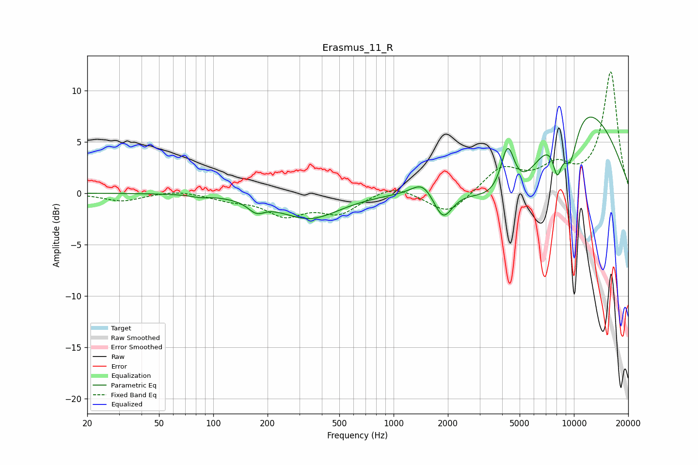

# Erasmus_11_R
See [usage instructions](https://github.com/jaakkopasanen/AutoEq#usage) for more options and info.

### Parametric EQs
Apply preamp of -7.5 dB when using parametric equalizer.

|   # | Type    |   Fc (Hz) |    Q |   Gain (dB) |
|-----|---------|-----------|------|-------------|
|   1 | Peaking |        84 | 3.39 |        -0.2 |
|   2 | Peaking |       173 | 3.08 |        -1   |
|   3 | Peaking |       342 | 0.85 |        -2.4 |
|   4 | Peaking |      1450 | 2.42 |         1.4 |
|   5 | Peaking |      1880 | 2.78 |        -2.8 |
|   6 | Peaking |      4291 | 3.43 |         5.4 |
|   7 | Peaking |      4658 | 0.77 |        -7.3 |
|   8 | Peaking |      8091 | 5.17 |        -3.4 |
|   9 | Peaking |      9312 | 0.38 |        10.6 |
|  10 | Peaking |      9524 | 2.79 |        -4.7 |

### Fixed Band EQs
When using fixed band (also called graphic) equalizer, apply preamp of **-11.9 dB** (if available) and set gains manually with these parameters.

|   # | Type    |   Fc (Hz) |    Q |   Gain (dB) |
|-----|---------|-----------|------|-------------|
|   1 | Peaking |        31 | 1.41 |        -0.8 |
|   2 | Peaking |        62 | 1.41 |         0.3 |
|   3 | Peaking |       125 | 1.41 |        -0.6 |
|   4 | Peaking |       250 | 1.41 |        -2   |
|   5 | Peaking |       500 | 1.41 |        -1.8 |
|   6 | Peaking |      1000 | 1.41 |         0.9 |
|   7 | Peaking |      2000 | 1.41 |        -2.1 |
|   8 | Peaking |      4000 | 1.41 |         2.4 |
|   9 | Peaking |      8000 | 1.41 |         2.2 |
|  10 | Peaking |     16000 | 1.41 |        11.8 |

### Graphs

