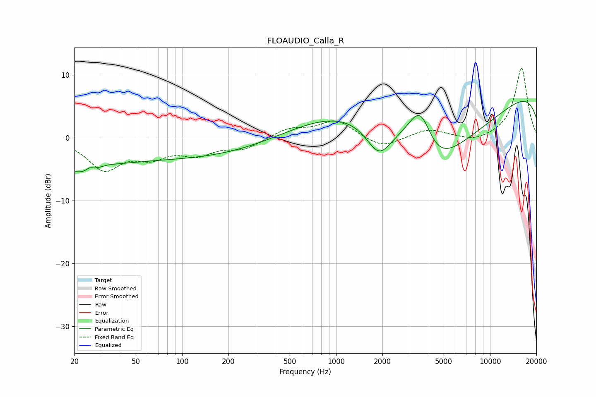

# FLOAUDIO_Calla_R
See [usage instructions](https://github.com/jaakkopasanen/AutoEq#usage) for more options and info.

### Parametric EQs
Apply preamp of -5.9 dB when using parametric equalizer.

|   # | Type    |   Fc (Hz) |    Q |   Gain (dB) |
|-----|---------|-----------|------|-------------|
|   1 | Peaking |        21 | 4.73 |         0.1 |
|   2 | Peaking |        22 | 0.8  |        -4.6 |
|   3 | Peaking |        25 | 5.84 |         0.7 |
|   4 | Peaking |        32 | 1.69 |         0.8 |
|   5 | Peaking |       126 | 0.2  |        -3.3 |
|   6 | Peaking |      1590 | 0.31 |         9   |
|   7 | Peaking |      1900 | 1.64 |        -5.4 |
|   8 | Peaking |      3542 | 1.57 |         9.4 |
|   9 | Peaking |      4170 | 0.45 |       -20   |
|  10 | Peaking |     10000 | 0.18 |         9.9 |

### Fixed Band EQs
When using fixed band (also called graphic) equalizer, apply preamp of **-11.2 dB** (if available) and set gains manually with these parameters.

|   # | Type    |   Fc (Hz) |    Q |   Gain (dB) |
|-----|---------|-----------|------|-------------|
|   1 | Peaking |        31 | 1.41 |        -4.8 |
|   2 | Peaking |        62 | 1.41 |        -2.5 |
|   3 | Peaking |       125 | 1.41 |        -2.3 |
|   4 | Peaking |       250 | 1.41 |        -1.6 |
|   5 | Peaking |       500 | 1.41 |         1.4 |
|   6 | Peaking |      1000 | 1.41 |         2.7 |
|   7 | Peaking |      2000 | 1.41 |        -1.7 |
|   8 | Peaking |      4000 | 1.41 |         1.4 |
|   9 | Peaking |      8000 | 1.41 |        -0.8 |
|  10 | Peaking |     16000 | 1.41 |        11.2 |

### Graphs

