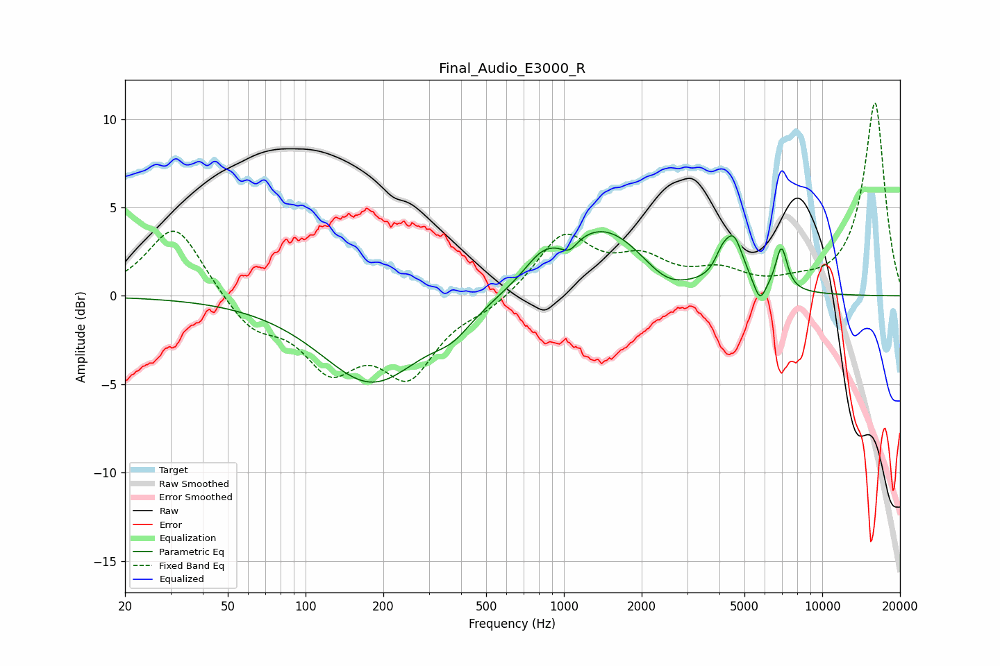

# Final_Audio_E3000_R
See [usage instructions](https://github.com/jaakkopasanen/AutoEq#usage) for more options and info.

### Parametric EQs
Apply preamp of -3.7 dB when using parametric equalizer.

|   # | Type    |   Fc (Hz) |    Q |   Gain (dB) |
|-----|---------|-----------|------|-------------|
|   1 | Peaking |       181 | 0.71 |        -4.9 |
|   2 | Peaking |       371 | 1.89 |        -1   |
|   3 | Peaking |       819 | 2.15 |         1   |
|   4 | Peaking |      1050 | 4.6  |        -0.7 |
|   5 | Peaking |      1407 | 0.78 |         4   |
|   6 | Peaking |      2482 | 1.55 |        -1.1 |
|   7 | Peaking |      4073 | 5.37 |         0.8 |
|   8 | Peaking |      4537 | 3.6  |         2.7 |
|   9 | Peaking |      5737 | 6    |        -1.2 |
|  10 | Peaking |      6952 | 5.99 |         2.4 |

### Fixed Band EQs
When using fixed band (also called graphic) equalizer, apply preamp of **-11.0 dB** (if available) and set gains manually with these parameters.

|   # | Type    |   Fc (Hz) |    Q |   Gain (dB) |
|-----|---------|-----------|------|-------------|
|   1 | Peaking |        31 | 1.41 |         4.1 |
|   2 | Peaking |        62 | 1.41 |        -1.8 |
|   3 | Peaking |       125 | 1.41 |        -3.7 |
|   4 | Peaking |       250 | 1.41 |        -4.1 |
|   5 | Peaking |       500 | 1.41 |        -0.6 |
|   6 | Peaking |      1000 | 1.41 |         3.4 |
|   7 | Peaking |      2000 | 1.41 |         1.7 |
|   8 | Peaking |      4000 | 1.41 |         1.1 |
|   9 | Peaking |      8000 | 1.41 |         0.4 |
|  10 | Peaking |     16000 | 1.41 |        10.9 |

### Graphs

