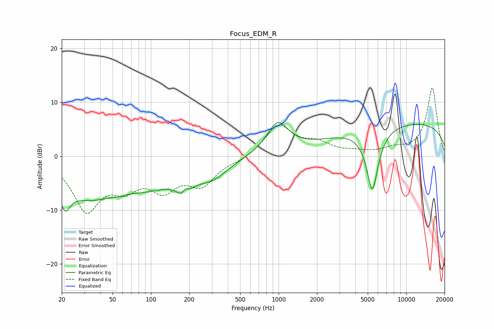

# Focus_EDM_R
See [usage instructions](https://github.com/jaakkopasanen/AutoEq#usage) for more options and info.

### Parametric EQs
Apply preamp of -6.3 dB when using parametric equalizer.

|   # | Type    |   Fc (Hz) |    Q |   Gain (dB) |
|-----|---------|-----------|------|-------------|
|   1 | Peaking |        21 | 3.6  |        -4.3 |
|   2 | Peaking |        32 | 0.58 |        -6.6 |
|   3 | Peaking |        56 | 5.11 |        -0.2 |
|   4 | Peaking |       102 | 0.56 |        -4.2 |
|   5 | Peaking |       183 | 3.21 |        -5   |
|   6 | Peaking |       185 | 4.84 |         3.4 |
|   7 | Peaking |       300 | 1.11 |        -3.1 |
|   8 | Peaking |       983 | 1.66 |         5.7 |
|   9 | Peaking |      5431 | 2.92 |       -11.8 |
|  10 | Peaking |     10000 | 0.19 |         6.2 |

### Fixed Band EQs
When using fixed band (also called graphic) equalizer, apply preamp of **-12.8 dB** (if available) and set gains manually with these parameters.

|   # | Type    |   Fc (Hz) |    Q |   Gain (dB) |
|-----|---------|-----------|------|-------------|
|   1 | Peaking |        31 | 1.41 |        -9.6 |
|   2 | Peaking |        62 | 1.41 |        -4.5 |
|   3 | Peaking |       125 | 1.41 |        -5.2 |
|   4 | Peaking |       250 | 1.41 |        -4.8 |
|   5 | Peaking |       500 | 1.41 |        -0.7 |
|   6 | Peaking |      1000 | 1.41 |         5.7 |
|   7 | Peaking |      2000 | 1.41 |         2   |
|   8 | Peaking |      4000 | 1.41 |         0.5 |
|   9 | Peaking |      8000 | 1.41 |         1   |
|  10 | Peaking |     16000 | 1.41 |        12.7 |

### Graphs

