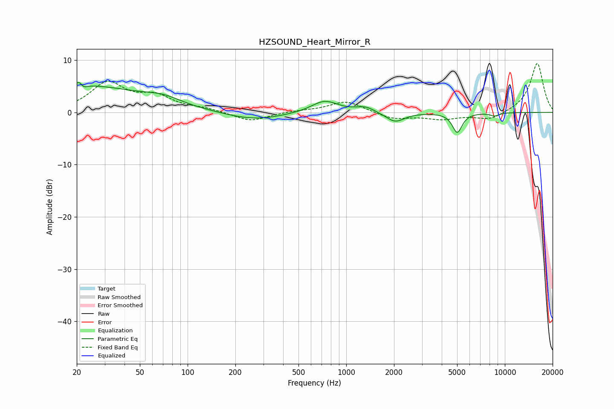

# HZSOUND_Heart_Mirror_R
See [usage instructions](https://github.com/jaakkopasanen/AutoEq#usage) for more options and info.

### Parametric EQs
Apply preamp of -5.8 dB when using parametric equalizer.

|   # | Type    |   Fc (Hz) |    Q |   Gain (dB) |
|-----|---------|-----------|------|-------------|
|   1 | Peaking |        21 | 5.91 |         3.3 |
|   2 | Peaking |        21 | 0.36 |         5   |
|   3 | Peaking |        22 | 5.98 |        -3   |
|   4 | Peaking |        70 | 1.28 |         1.3 |
|   5 | Peaking |       262 | 0.78 |        -1.5 |
|   6 | Peaking |       730 | 1.69 |         2.3 |
|   7 | Peaking |      1318 | 2.43 |         1   |
|   8 | Peaking |      2034 | 2.42 |        -1.9 |
|   9 | Peaking |      5009 | 4.6  |        -3.8 |
|  10 | Peaking |      8618 | 4.52 |        -0.6 |

### Fixed Band EQs
When using fixed band (also called graphic) equalizer, apply preamp of **-9.4 dB** (if available) and set gains manually with these parameters.

|   # | Type    |   Fc (Hz) |    Q |   Gain (dB) |
|-----|---------|-----------|------|-------------|
|   1 | Peaking |        31 | 1.41 |         5.4 |
|   2 | Peaking |        62 | 1.41 |         2.7 |
|   3 | Peaking |       125 | 1.41 |         0.6 |
|   4 | Peaking |       250 | 1.41 |        -1.8 |
|   5 | Peaking |       500 | 1.41 |         0.3 |
|   6 | Peaking |      1000 | 1.41 |         2.2 |
|   7 | Peaking |      2000 | 1.41 |        -1.3 |
|   8 | Peaking |      4000 | 1.41 |        -1.2 |
|   9 | Peaking |      8000 | 1.41 |        -1.5 |
|  10 | Peaking |     16000 | 1.41 |         9.5 |

### Graphs

