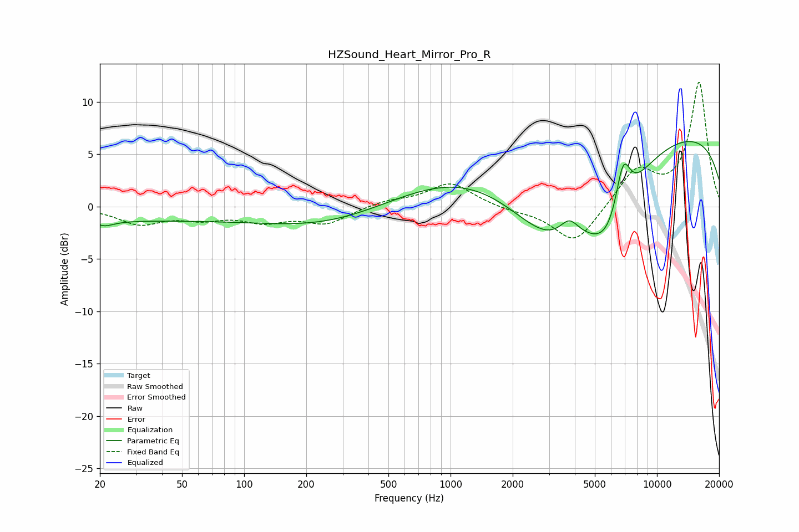

# HZSound_Heart_Mirror_Pro_R
See [usage instructions](https://github.com/jaakkopasanen/AutoEq#usage) for more options and info.

### Parametric EQs
Apply preamp of -6.3 dB when using parametric equalizer.

|   # | Type    |   Fc (Hz) |    Q |   Gain (dB) |
|-----|---------|-----------|------|-------------|
|   1 | Peaking |        21 | 3.14 |        -0.6 |
|   2 | Peaking |        24 | 1.31 |        -0.1 |
|   3 | Peaking |        32 | 0.26 |        -1.2 |
|   4 | Peaking |       247 | 0.47 |        -1.7 |
|   5 | Peaking |      1306 | 0.42 |         3.6 |
|   6 | Peaking |      3070 | 0.59 |        -8.5 |
|   7 | Peaking |      3756 | 3.08 |         1.7 |
|   8 | Peaking |      5891 | 1.15 |        -6.4 |
|   9 | Peaking |      6846 | 3.62 |         5.1 |
|  10 | Peaking |      9964 | 0.18 |         7.5 |

### Fixed Band EQs
When using fixed band (also called graphic) equalizer, apply preamp of **-12.0 dB** (if available) and set gains manually with these parameters.

|   # | Type    |   Fc (Hz) |    Q |   Gain (dB) |
|-----|---------|-----------|------|-------------|
|   1 | Peaking |        31 | 1.41 |        -1.6 |
|   2 | Peaking |        62 | 1.41 |        -0.9 |
|   3 | Peaking |       125 | 1.41 |        -1.2 |
|   4 | Peaking |       250 | 1.41 |        -1.5 |
|   5 | Peaking |       500 | 1.41 |         0.5 |
|   6 | Peaking |      1000 | 1.41 |         2.3 |
|   7 | Peaking |      2000 | 1.41 |        -0.3 |
|   8 | Peaking |      4000 | 1.41 |        -3.6 |
|   9 | Peaking |      8000 | 1.41 |         3.5 |
|  10 | Peaking |     16000 | 1.41 |        11.8 |

### Graphs

