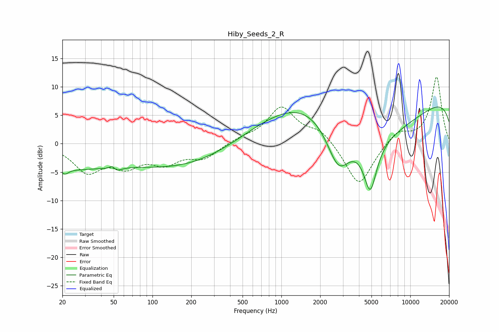

# Hiby_Seeds_2_R
See [usage instructions](https://github.com/jaakkopasanen/AutoEq#usage) for more options and info.

### Parametric EQs
Apply preamp of -6.5 dB when using parametric equalizer.

|   # | Type    |   Fc (Hz) |    Q |   Gain (dB) |
|-----|---------|-----------|------|-------------|
|   1 | Peaking |        21 | 5.04 |        -1   |
|   2 | Peaking |        22 | 0.49 |        -3.8 |
|   3 | Peaking |        49 | 4.85 |         3.2 |
|   4 | Peaking |        50 | 3.99 |        -3.2 |
|   5 | Peaking |       184 | 0.3  |        -4.4 |
|   6 | Peaking |      1953 | 0.29 |        11.6 |
|   7 | Peaking |      2770 | 1.36 |        -9.5 |
|   8 | Peaking |      4891 | 2.68 |        -9   |
|   9 | Peaking |      5283 | 0.31 |       -15.4 |
|  10 | Peaking |      9950 | 0.18 |        12.7 |

### Fixed Band EQs
When using fixed band (also called graphic) equalizer, apply preamp of **-11.8 dB** (if available) and set gains manually with these parameters.

|   # | Type    |   Fc (Hz) |    Q |   Gain (dB) |
|-----|---------|-----------|------|-------------|
|   1 | Peaking |        31 | 1.41 |        -4.6 |
|   2 | Peaking |        62 | 1.41 |        -3.4 |
|   3 | Peaking |       125 | 1.41 |        -3   |
|   4 | Peaking |       250 | 1.41 |        -2.4 |
|   5 | Peaking |       500 | 1.41 |         0.8 |
|   6 | Peaking |      1000 | 1.41 |         6.3 |
|   7 | Peaking |      2000 | 1.41 |         2.3 |
|   8 | Peaking |      4000 | 1.41 |        -7.7 |
|   9 | Peaking |      8000 | 1.41 |         2.3 |
|  10 | Peaking |     16000 | 1.41 |        11.7 |

### Graphs

