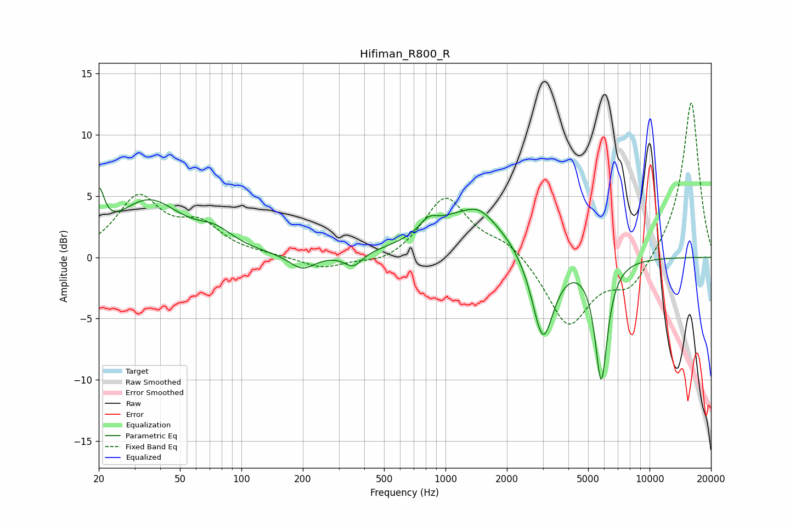

# Hifiman_R800_R
See [usage instructions](https://github.com/jaakkopasanen/AutoEq#usage) for more options and info.

### Parametric EQs
Apply preamp of -5.8 dB when using parametric equalizer.

|   # | Type    |   Fc (Hz) |    Q |   Gain (dB) |
|-----|---------|-----------|------|-------------|
|   1 | Peaking |        20 | 5.5  |         3.5 |
|   2 | Peaking |        35 | 0.89 |         4.4 |
|   3 | Peaking |        74 | 1.56 |         1.3 |
|   4 | Peaking |       199 | 2.28 |        -1.2 |
|   5 | Peaking |       353 | 3.27 |        -1.1 |
|   6 | Peaking |       827 | 3.25 |         1   |
|   7 | Peaking |      1334 | 0.73 |         3.7 |
|   8 | Peaking |      1471 | 2.27 |         0.6 |
|   9 | Peaking |      3001 | 2.58 |        -7.4 |
|  10 | Peaking |      5796 | 4.48 |        -9.9 |

### Fixed Band EQs
When using fixed band (also called graphic) equalizer, apply preamp of **-12.7 dB** (if available) and set gains manually with these parameters.

|   # | Type    |   Fc (Hz) |    Q |   Gain (dB) |
|-----|---------|-----------|------|-------------|
|   1 | Peaking |        31 | 1.41 |         4.7 |
|   2 | Peaking |        62 | 1.41 |         2.3 |
|   3 | Peaking |       125 | 1.41 |         0.1 |
|   4 | Peaking |       250 | 1.41 |        -1   |
|   5 | Peaking |       500 | 1.41 |        -0.7 |
|   6 | Peaking |      1000 | 1.41 |         4.9 |
|   7 | Peaking |      2000 | 1.41 |         1.2 |
|   8 | Peaking |      4000 | 1.41 |        -5.6 |
|   9 | Peaking |      8000 | 1.41 |        -2.5 |
|  10 | Peaking |     16000 | 1.41 |        12.9 |

### Graphs

