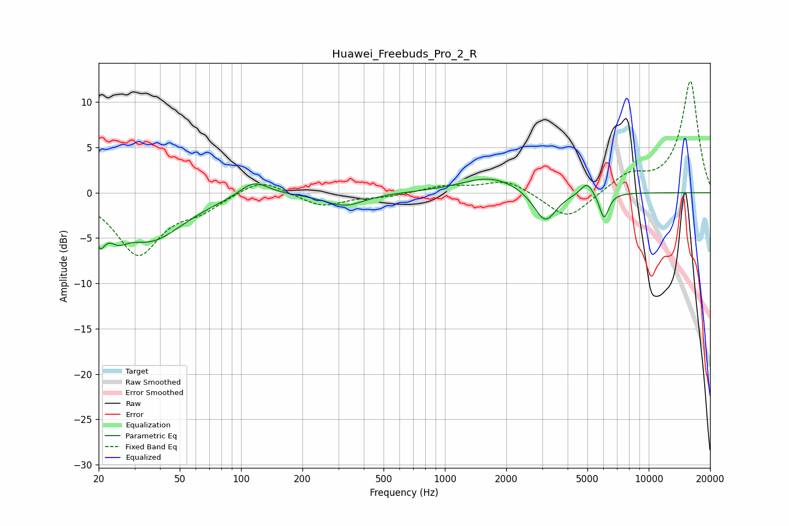

# Huawei_Freebuds_Pro_2_R
See [usage instructions](https://github.com/jaakkopasanen/AutoEq#usage) for more options and info.

### Parametric EQs
Apply preamp of -1.6 dB when using parametric equalizer.

|   # | Type    |   Fc (Hz) |    Q |   Gain (dB) |
|-----|---------|-----------|------|-------------|
|   1 | Peaking |        20 | 6    |         2.8 |
|   2 | Peaking |        20 | 5.7  |        -5.8 |
|   3 | Peaking |        25 | 3.09 |        -1.8 |
|   4 | Peaking |        36 | 0.87 |        -5.1 |
|   5 | Peaking |       116 | 1.97 |         1.8 |
|   6 | Peaking |       322 | 1.48 |        -1.4 |
|   7 | Peaking |      1681 | 0.99 |         1.8 |
|   8 | Peaking |      3103 | 2.55 |        -3.6 |
|   9 | Peaking |      4976 | 4.63 |         1.4 |
|  10 | Peaking |      6041 | 6    |        -2.9 |

### Fixed Band EQs
When using fixed band (also called graphic) equalizer, apply preamp of **-12.4 dB** (if available) and set gains manually with these parameters.

|   # | Type    |   Fc (Hz) |    Q |   Gain (dB) |
|-----|---------|-----------|------|-------------|
|   1 | Peaking |        31 | 1.41 |        -6.7 |
|   2 | Peaking |        62 | 1.41 |        -1.5 |
|   3 | Peaking |       125 | 1.41 |         1.7 |
|   4 | Peaking |       250 | 1.41 |        -1.5 |
|   5 | Peaking |       500 | 1.41 |        -0.4 |
|   6 | Peaking |      1000 | 1.41 |         0.7 |
|   7 | Peaking |      2000 | 1.41 |         1.4 |
|   8 | Peaking |      4000 | 1.41 |        -3   |
|   9 | Peaking |      8000 | 1.41 |         1.9 |
|  10 | Peaking |     16000 | 1.41 |        12.3 |

### Graphs

