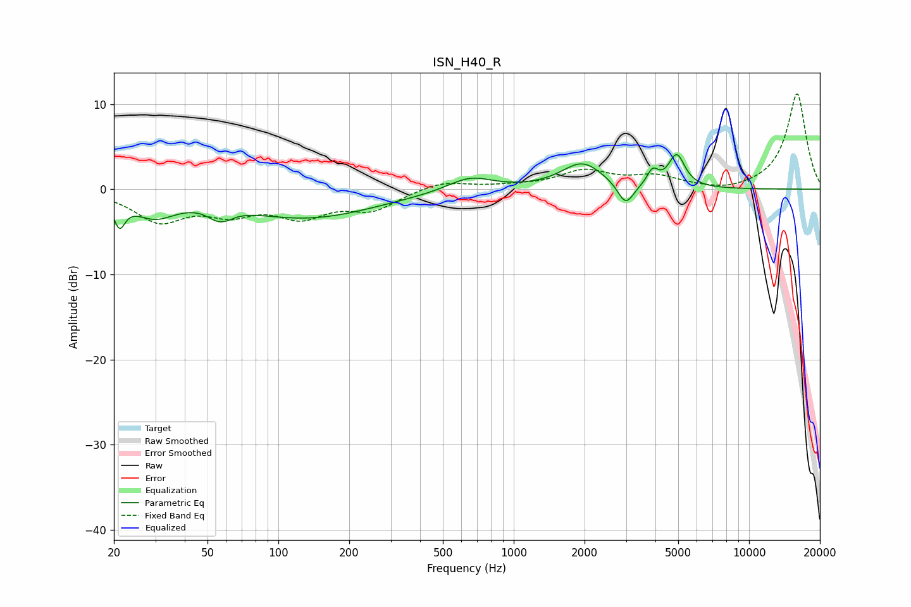

# ISN_H40_R
See [usage instructions](https://github.com/jaakkopasanen/AutoEq#usage) for more options and info.

### Parametric EQs
Apply preamp of -4.2 dB when using parametric equalizer.

|   # | Type    |   Fc (Hz) |    Q |   Gain (dB) |
|-----|---------|-----------|------|-------------|
|   1 | Peaking |        21 | 5.96 |        -3   |
|   2 | Peaking |        30 | 1.55 |        -2.7 |
|   3 | Peaking |        57 | 3.71 |        -3.7 |
|   4 | Peaking |        57 | 4.51 |         2.1 |
|   5 | Peaking |       133 | 0.48 |        -3.3 |
|   6 | Peaking |       652 | 1.49 |         1.7 |
|   7 | Peaking |      1958 | 1.59 |         3.1 |
|   8 | Peaking |      2992 | 4.09 |        -2.7 |
|   9 | Peaking |      3895 | 6    |         1.7 |
|  10 | Peaking |      4927 | 4.09 |         3.8 |

### Fixed Band EQs
When using fixed band (also called graphic) equalizer, apply preamp of **-11.3 dB** (if available) and set gains manually with these parameters.

|   # | Type    |   Fc (Hz) |    Q |   Gain (dB) |
|-----|---------|-----------|------|-------------|
|   1 | Peaking |        31 | 1.41 |        -3.5 |
|   2 | Peaking |        62 | 1.41 |        -2.3 |
|   3 | Peaking |       125 | 1.41 |        -2.8 |
|   4 | Peaking |       250 | 1.41 |        -2.2 |
|   5 | Peaking |       500 | 1.41 |         1   |
|   6 | Peaking |      1000 | 1.41 |         0.3 |
|   7 | Peaking |      2000 | 1.41 |         2   |
|   8 | Peaking |      4000 | 1.41 |         1.3 |
|   9 | Peaking |      8000 | 1.41 |        -0.5 |
|  10 | Peaking |     16000 | 1.41 |        11.3 |

### Graphs

