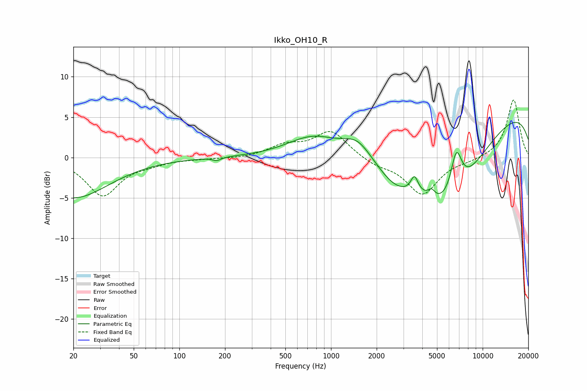

# Ikko_OH10_R
See [usage instructions](https://github.com/jaakkopasanen/AutoEq#usage) for more options and info.

### Parametric EQs
Apply preamp of -4.4 dB when using parametric equalizer.

|   # | Type    |   Fc (Hz) |    Q |   Gain (dB) |
|-----|---------|-----------|------|-------------|
|   1 | Peaking |        20 | 0.6  |        -5   |
|   2 | Peaking |       177 | 5.04 |        -0.4 |
|   3 | Peaking |       754 | 0.85 |         2.4 |
|   4 | Peaking |      1498 | 1.51 |         2.2 |
|   5 | Peaking |      2645 | 1.06 |        -2.9 |
|   6 | Peaking |      3551 | 5.9  |         2   |
|   7 | Peaking |      4601 | 6    |         1   |
|   8 | Peaking |      5768 | 0.57 |       -11.6 |
|   9 | Peaking |      6703 | 3.58 |         5.3 |
|  10 | Peaking |     10000 | 0.18 |         6.9 |

### Fixed Band EQs
When using fixed band (also called graphic) equalizer, apply preamp of **-7.2 dB** (if available) and set gains manually with these parameters.

|   # | Type    |   Fc (Hz) |    Q |   Gain (dB) |
|-----|---------|-----------|------|-------------|
|   1 | Peaking |        31 | 1.41 |        -4.7 |
|   2 | Peaking |        62 | 1.41 |        -0.6 |
|   3 | Peaking |       125 | 1.41 |        -0.1 |
|   4 | Peaking |       250 | 1.41 |        -0.2 |
|   5 | Peaking |       500 | 1.41 |         1.4 |
|   6 | Peaking |      1000 | 1.41 |         3.3 |
|   7 | Peaking |      2000 | 1.41 |        -0.9 |
|   8 | Peaking |      4000 | 1.41 |        -4.5 |
|   9 | Peaking |      8000 | 1.41 |        -0.3 |
|  10 | Peaking |     16000 | 1.41 |         7.2 |

### Graphs

